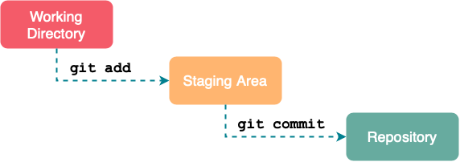
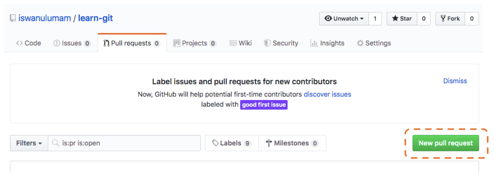
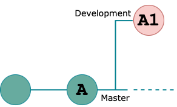
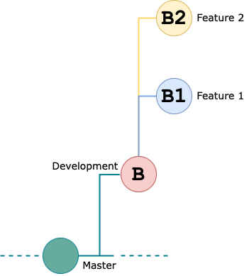
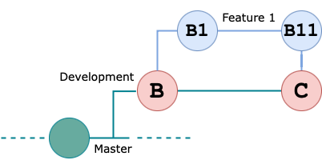
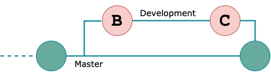

# **Git**

Versioning Control and Branch Management

---
<!-- _class: lead -->
# What is Versioning?


Control the source code version

---
<!-- _class: lead -->
# The Problem
</br>


*Revision is a **must**, don't expect every code is **perfect***

---
# What is Git?
<!-- _class: lead -->


One of the popular **version control system** used by **developers** to develop software **together**.

---
<!-- _class: lead -->
# Everyone **Should Sync to The Remote Server**


---
# Git **Track** Every File Change
<!-- _class: lead -->


Your changes, John's changes and everyone changes can be tracked by git

---
# Install Git **On Mac**

1. Download latest [Git for Mac Installer](https://sourceforge.net/projects/git-osx-installer/files/)
2. Follow the prompts to install git
3. Open a terminal and verify the installation was successful by typing `git --version`

```bash
$ git --version
git version 2.35.1
```
---
# Install Git **On Windows**
1. Download latest [Git for Mac Installer](https://git-for-windows.github.io/)
2. When you've successfully started the installer, you should see the Git Setup wizard screen. Follow the Next and Finish prompts to complete the installation. The default options are pretty sensible for most users
3. Open a Command Prompt (or Git Bash if during installation you elected not to use Git from the Windows Command Prompt)

---
# Install Git **On Linux**
1. From your shell, install git using `apt-get`
    ```bash
    $ sudo apt-get update
    $ sudo apt-get install git
    ```
2. Verify the installation was successful by typing `git --version`
    ```bash
    $ git --version
    git version 2.35.1
    ```

---
# Git Configuration
### GIT **INIT, CLONE, CONFIG**

```bash
## Git Global Configuration
$ git config --global user.name "John Doe"
$ git config --global user.email "johndoe@example.com"

## Git Initialization
$ git init
$ git remote add <REMOTE_NAME> <REMOTE_REPOSITORY_URL>
$ git push -u <REMOTE_NAME> <LOCAL_BRANCH_NAME>

## Start with existing project, start working on the project
$ git clone <REMOTE_REPOSITORY_URL> myproject
$ cd myproject
```

---
# **Staging** Area
<!-- _class: lead -->


---
# Commit **Message**

If applied, this commit will be **your subject line here**
Better writing commit message with writing convention based on this [reference](https://medium.com/swlh/writing-better-commit-messages-9b0b6ff60c67).

Type of commit :
```bash
feat:       The new feature being added to a particular application
fix:        A bug fix (this correlates with PATCH in SemVer)
style:      Feature and updates related to styling
refactor:   Refactoring a specific section of the codebase
test:       Everything related to testing
docs:       Everything related to documentation
chore:      Regular code maintenance
```

---
# Synchronizing Git **Push, Fetch, & Pull**

```bash
## Git remote
$ git remote -v
$ git remote add origin https://github.com/example.git

## Fetch and pull
$ git fetch --all
$ git pull origin master

## Push
$ git push origin master
$ git push origin feature/login-user
```

---
# Git **Branching**

```bash
## Show all branch list
$ git branch

## Create new branch
$ git branch feature/registration
$ git checkout feature/registration

## Force delete specified branch
$ git branch -D <BRANCH_NAME>

## List remote branch
$ git branch -a
```

---
# Pull **Request**


---
# **Workflow** Collaboration
<!-- _class: lead -->


---
# Do you work like this?
<!-- _class: lead -->


---
# Or like this?
<!-- _class: lead -->


---
# The **best way** like this
<!-- _class: lead -->


---
# Let the **Master Branch** Undisturbed


```bash
$ (master) git branch development
$ (master) git checkout development
```

---
# Avoid **Direct Edit** on Development


```bash
$ (development) git branch feature/new-feature
$ (development) git checkout feature/new-feature
```

---
# Apply **Feature** into Development Only


```bash
$ (feature/new-feature) git checkout development
$ (development) git merge feature/new-feature
```

---
# Apply **Development** into Master
**When it's already done**



```bash
$ (master) git merge development
```

---
# Any **Question**
<!-- _class: lead -->
