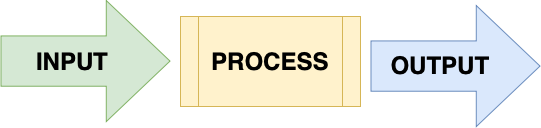
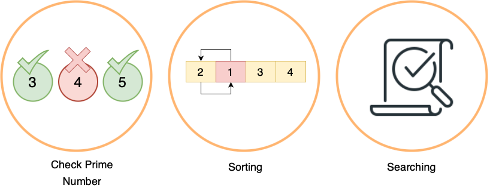
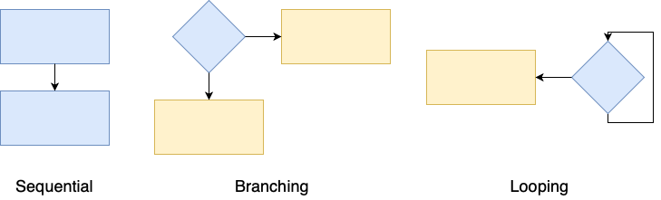
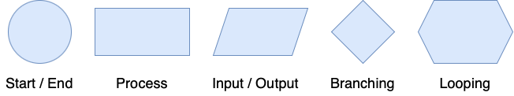
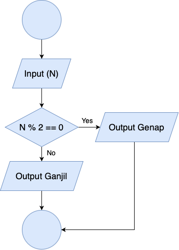
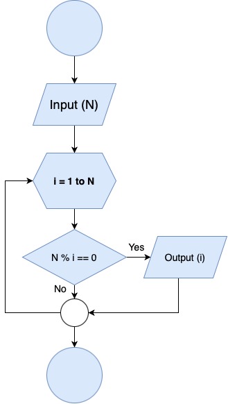

# **Algorithm**

Basic Algorithm

---
<!-- _class: lead -->
# What is Algorithm?

Algorithm is a well defined **computational procedure** which takes some values ​​as **input** and produces some values ​​as **output**.

---
<!-- _class: lead -->
# Example Implementation

---
# Characteristic
- Have **start** and **end**
- Well defined instructions
- Effective and eficient

---
# Flowchart

Flowchart is a chart with certain symbols that describe the **order** and **relationship** between processes in detail.
 

#### Flowchart Symbol

---
# Study Case

Determine odd or even number

---
# Study Case

Prints factor numbers

---
# Task

A prime number is a natural number that is greater than 1, whose divisors are **1** and the **number itself**. The numbers **2** and **3** are **prime numbers**. The number 4 is not a prime number because it can be divided by 2.  *Create a function to determine whether the inputted number is a prime number or not using [Whimsical](https://whimsical.com)*. Example :
- Input: 3, Output: Prime Number
- Input: 7, Output: Prime Number
- Input: 10, Output: Not Prime Number