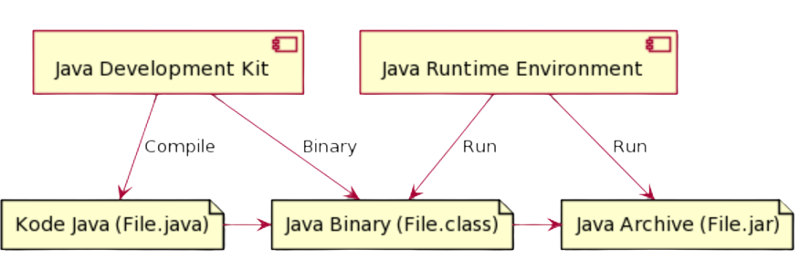
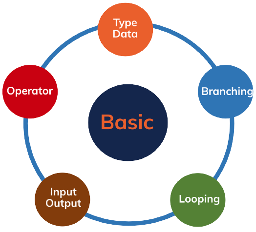
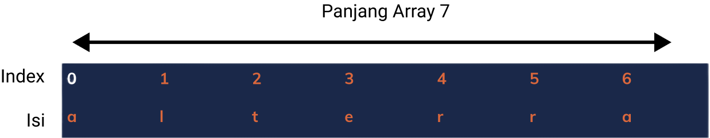
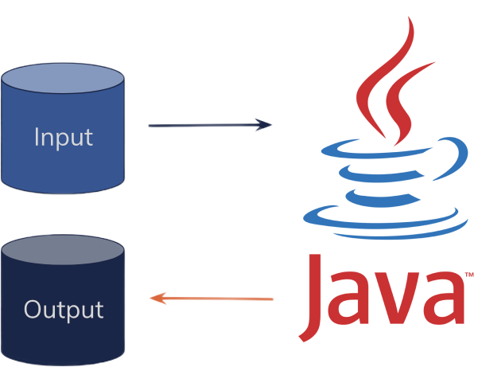
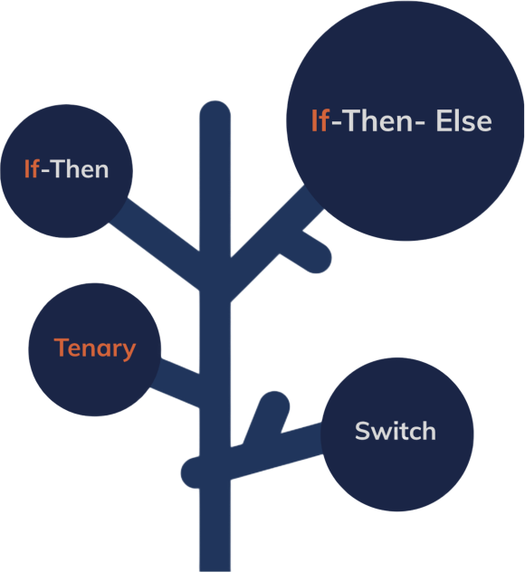
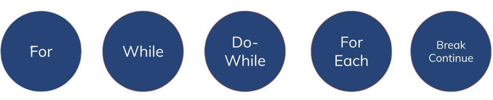

# **Basic Programming**

Rawlabs Academy

---
# Tools and IDE
- Java Development Kit (JDK) <br>
 &nbsp;&nbsp;&nbsp;&nbsp;  &nbsp;&nbsp;&nbsp;&nbsp; 
- Integrated Development Environment (IDE) <br>
 &nbsp;&nbsp;  &nbsp;&nbsp;  &nbsp;&nbsp; 

---
# Java Development Process



---
# Basic Programming

**Hello World!**

```java
public class Main {

    public static void main(String[] args) {
        System.out.println("Hello World!");
    }

}
```

---


---
<style scoped>
table {
    font-size: 0.8rem;
}
</style>
# Data Type (Integer)
| Data Type | Min | Max | Size | Default |
-----|------|-------|-------|-------|
byte | -128 | 127 | 1 byte | 0 |
short | -32,768 | 32,767 | 2 bytes | 0 |
int | -2,147,483,648 | -2,147,483,647 | 4 bytes | 0 |
long | -9,223,372,036, 854,755,808 | -9,223,372,036, 854,755,807 | 8 bytes | 0 |

---
# Data Type (Decimal)
| Data Type | Min | Max | Size | Default |
-----|------|-------|-------|-------|
float | 3.4e-038 | 34.e+038 | 4 bytes | 0 |
double | 1.7e-308 | 1.7e+308 | 8 bytes | 0 |

---
# Variable

**Declaration**
- `data_type variable_name = value`

**Example**
```java
int myInt;
long balance = 100000l;
String name = "Maverick";
double value = 1.71;

int age = 10;
byte ageAsByte = (byte) age;
```

---
<style scoped>
table {
    font-size: 0.8rem;
}
p {
    font-size: 0.8rem;
}
</style>
## Primitive & **Non** Primitive
**Primitive** default value is **0** but, **non primitive** is allow **nullable**;
| Data Type **Primitve** | Data Type **Non Primitive** |
|------|------|
| byte | Byte |
| short | Short |
| int | Integer |
| long | Long |
| float | Float |
| double | Double |
| char | Char |
| boolean | Boolean |

---
# Array



---
## Array Example

```java
char[] rawlabs = new char[] {'r','a','w','l','a','b','s'};

char[] rlabs = new char[7];
rlabs[0] = 'r';
rlabs[1] = 'a';
rlabs[2] = 'w';
rlabs[3] = 'l';
rlabs[4] = 'a';
rlabs[5] = 'b';
rlabs[6] = 's';
```

---
# Operator

| Operator | Symbol |
|------|:------:|
| Assignment | **=** |
| Arithmetic | **+ &nbsp; - &nbsp;  * &nbsp;  / &nbsp;  %** |
| Unary | **+ &nbsp; - &nbsp; ++ &nbsp; -- &nbsp; !** |
| Equality and Relational | **== &nbsp; != &nbsp; > &nbsp; >= &nbsp; < &nbsp; <=** |
| Conditional | **&& &nbsp; \|\|** |

---
<!-- _class: lead -->
# Input & Output


---
# Input

```java
import java.util.Scanner;

public class Main {
    public static void main(String[] args) {
        Scanner in = new Scanner(System.in);
        System.out.print("Enter an integer number: ");
        
        int number = in.nextInt();
        System.out.println("You have entered " + number);
        
        // Closing the input
        in.close();
    }
}
```

---
# Output

```java
public class Main {

    public static void main(String[] args) {
        Double number = 1.67;

        System.out.println(5);
        System.out.println(number);
    }

}
```

---
# Branching


---
### If-Else

```java
public static void main(String[] args) {
    String userRole = "ADMIN";
    if (userRole == "ADMIN") {
        System.out.println("Role: ADMIN");
    } else {
        System.out.prinln("Role: USER");
    }

    boolean valid = true;
    if (!valid) {
        System.out.println("Invalid!");
    }
}
```
---
### Switch

```java
public static void main(String[] args) {
    switch(userRole) {
        case "ADMIN":
            token = "tokenAdmin";
            break;
        case "USER":
            token = "tokenUser";
            break;
        default:
            token = "Unauthorized";
            break;
    }
}
```
---
# Looping

<br>



---
### For Loop

```java
for (int i = 0; i < 10; i++) {
    System.out.println("Number: " + i);
}
```

### While Loop

```java
int i = 0;
while(i < 10) {
    System.out.println("Number: " + i);
    i++;
}
```
---

### Do-While Loop
```java
int i = 0;
do {
    System.out.println("Number: " + i);
    i++;
} while(i < 10);
```

### Foreach Loop
```java
String names = {"Calvin", "Maverick", "Joe", "John"}
for (String name : names) {
    System.out.println("My name is: " + name);
}
```
---
### Break and Continue
```java
for (int i = 0; i < 10; i++) {
    if (i == 3 || i == 5) {
        System.out.println("I will continue while looping on number: " + i);
        continue;
    }

    if (i == 7) {
        System.out.println("I will stop here on number: " + i);
        break;
    }
}
```

---
# Method
```java
public class Main {

    public static void main(String[] args) {
        System.out.println("Call the method in this line below");
        add(2, 3);
    }

    public static void add(int a, int b) {
        System.out.println(a + b);
    }

}
```

---
### Method with Return
```java
public class Main {

    public static void main(String[] args) {
        System.out.println("Call the method in this line below");
        System.out.println(add(2, 3));
    }

    public static int add(int a, int b) {
        return a + b;
    }

}
```
---
### Method with Argument
```java
public class Main {
    public static void main(String[] args) {
        System.out.println("Call the method in this line below");
        System.out.println(add(2, 3, 4, 5, 6));
    }

    public static int add(int... values) {
        int result = 0;
        for (int v : values) {
            result += v;
        }
        return result;
    }
}
```
---
### Comment
```java
/**
*
* Method to add 2 numbers
* You can write a multiple line of comments
*
*/
public static int add(int a, int b) {
    // Return add of 2 numbers
    return a + b;
}
```
---
## Task 1
Counts the number of characters in the form of vowels, consonants and total characters from the sentence *"Rahwlabs Academy"*.

**Input**: 
Rawlabs Academy

**Output**:
Vowels: 5
Consonants: 9
Total: 14

---
<style scoped>
p {
    font-size: 0.8rem;
}
</style>
## Task 2
**Palindrome** is a word, number, phrase, or other sequence of symbols that reads the same backwards as forwards. Write a program to detect whether a string is a palindrome or not.

Input: **katak**
Output: Palindrome

Input: **mister**
Output: Not Palindrome

Input: **kasur rusak**
Output: Palindrome