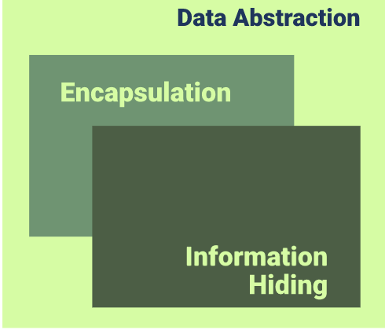
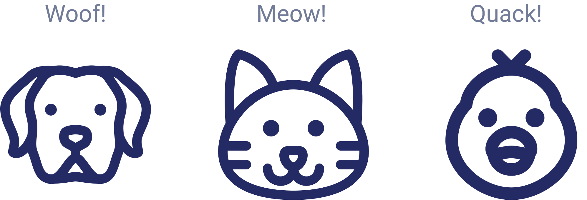
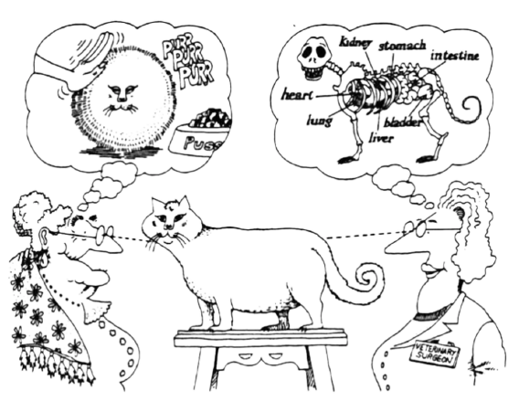
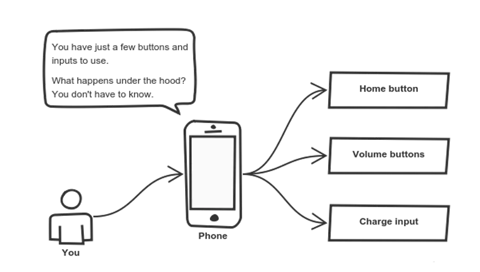

# **Object Oriented Programming**

Basic, Encapsulation and Data Abstraction

---
<style scoped>
    p {
        text-align: center;
        font-size: 1.7rem;
    }
</style>
<!-- _class: lead -->
> Programming paradigm which provides a means of structuring program so that **properties** and **behaviour** are bundled into individual **objects**.

---

## Properties
- Color
- Length
- Width

## Behavior
- Accelerate
- Break

---

## Properties
- Fur
- Leg
- Tail

## Behavior
- Make Sound
- Eat
- Jump

---
<style scoped>
    p {
        text-align: center;
        font-size: 1.7rem;
    }
</style>
<!-- _class: lead -->
> **Properties** determined by the values of its attributes

> **Behavior** determined by how the objects acts or reacts to requests

---
<!-- _class: lead -->
# OOP Fundamental Concept
<br>

 &nbsp;&nbsp;  &nbsp;&nbsp;  &nbsp;&nbsp; 

---

# Encapsulation
***Basic encapsulation analogy:***
- Class
- Attributes
- Method

---
<style scoped>
    p {
        font-size: 0.85rem;
    }
    ul {
        font-size: 0.85rem;
    }
</style>
### Encapsulation - **Class**

**Class** is a *"template"*  or *"blueprint"* that is used to create object.
**"Special code"** template in Java to make object:
- Contain of:
    - Properties
    - Method
- Has an init method to initiate object

```java
public class Cat { // Define class name using CamelCase
    private String name;
    private String color;
}
```
---
<style scoped>
    p {
        font-size: 0.85rem;
    }
    ul {
        font-size: 0.85rem;
    }
</style>
#### Make instance of Object
<div class="grid grid-cols-2 gap-4">
<div>

```java
public class Cat {
    private String name;
    private String color;

    // Constructor block
    public Cat(String name, String color) {
        this.name = name;
        this.color = color;
    }

    // Setter getter method
}

public static void main(String[] args) {
    Cat cat = new Cat("Peter", "White");
    cat.getName(); // Peter
    cat.getColor(); // White
}
```
</div>
<div>

An instance is a unique copy of a **Class** that representing an **Object**.
- All **classes** create **object**, and all **object** contain **characteristic** called **attribbutes**
- Use `new Object()` for creating new object in Java.

**Note:** You will never have to call the `new Object()` method; it gets called automatically when you create a new Cat object.
</div>
</div>

---
<style scoped>
    table {
        font-size: 0.7rem;
    },
    .text-success {
        color: #28a745!important
    },
    .text-danger {
        color: #dc3545!important
    }
</style>
### Attributes Type
<div class="grid grid-cols-2 gap-4">
<div>

```java
public class Cat {
    private String name;
    private String color;

    // Constructor block
    public Cat(String name, String color) {
        this.name = name;
        this.color = color;
    }

    // Setter getter method
}
```
</div>
<div>
<br><br>

| Modifier | Class | Package | Subclass | World |
|------|:------:|:------:|:------:|:------:|
|public| <i class="fa fa-check text-success"></i> | <i class="fa fa-check text-success"></i> | <i class="fa fa-check text-success"></i> | <i class="fa fa-check text-success"></i> |
| protected | <i class="fa fa-check text-success"></i> | <i class="fa fa-check text-success"></i> | <i class="fa fa-check text-success"></i> | <i class="fa fa-times text-danger"></i> |
| *no&nbsp;modifier** | <i class="fa fa-check text-success"></i> | <i class="fa fa-check text-success"></i> | <i class="fa fa-times text-danger"></i> | <i class="fa fa-times text-danger"></i> |
| private | <i class="fa fa-check text-success"></i> | <i class="fa fa-times text-danger"></i> | <i class="fa fa-times text-danger"></i> | <i class="fa fa-times text-danger"></i> |
</div>
</div>

---
### Method and Function
<div class="grid grid-cols-2 gap-4">
<div>

```java
public class Cat {
    private String name;
    private String color;

    public Cat(String name, String color) {
        this.name = name;
        this.color = color;
    }

    public void setName(String name) {
        this.name = name;
    }

    public String getName() {
        return this.name;
    }
}
```
</div>
<div>

Important things when creating **Method** or **Function**:
- Method name
- Parameters
- Returns
</div>
</div>

---

# Data Abstraction
***"Hiding background process from user"***

Main Goal:
- Handle complexity by hiding unnecessary detail
- It should only reveal operations relevant for the other objects

---
### Data Abstraction **Analogy**
 

---
<style scoped>
    p {
        font-size: 0.85rem;
    }
    ul {
        font-size: 0.85rem;
    }
</style>
### Data Abstraction - **Setter Getter**
<div class="grid grid-cols-2 gap-4">
<div>

```java
public interface Motorcycle {
    void startEngine();
}

public class Vario implements Motorcycle {
    @Override
    public void startEngine() {
        System.out.println("Use electric starter!");
    }
}

public class RXKing implements Motorcycle {
    @Override
    public void startEngine() {
        System.out.println("Use kick starter!");
    }
}
```
</div>
<div>

**Setter & Getter** make complex calculation in 1 function / method.
- Hide all unnecessary process in object calling itself
- Make simple calling from object variable
- Think of it as a small set of public methods which any other class can call without **"knowing"** how they work
</div>
</div>

---
<style scoped>
    p {
        font-size: 0.85rem;
    }
</style>
# Task
Define 5 classes freely related to the type of animal, plant or vehicle. Use encapsulation concepts such as public, protected and private according to analogy examples in the real world.

Example:
`Cat, Fish, Flower, Car, etc.`

Add instance variables and methods in each class created. Then create code to prove **encapsulation** is running as expected.

For example, can `Frog` access these `public`, `protected` or `private` variables? or other things that produce returns as expected.