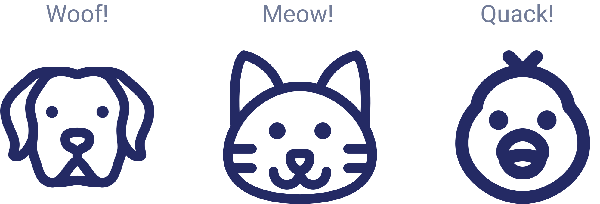

# **Object Oriented Programming**

Abstract Class, Abstract Method, Inheritence and Polymorphism

---
<style scoped>
    p {
        font-size: 0.85rem;
    }
    ul {
        font-size: 0.8rem;
    }
</style>
# Abstract **Class** and **Method**
<div class="grid grid-cols-2 gap-4">
<div>

```java
abstract class ProgrammingLanguage {
    abstract void describe();
    
    public void print() {
        System.out.println("Coding is fun!");
    }
}

public class Java extends ProgrammingLanguage {
    @Override
    public void describe() {
        System.out.println("Java use OOP concept.");
    }
}
```
</div>
<div>

**Abstract Class** :
- Must be declared with `abstract` keyword
- Can have abstract and non-abstract method
- Can not be instantiated
- Can have *constructor* and static method also
- Can have final methods which will force the subclass not to change the body of the method
</div>
</div>

---

<style scoped>
    p {
        font-size: 0.85rem;
    }
    ul {
        font-size: 0.85rem;
    }
</style>
# Inheritence

**Object Fact** :
- Object are often very similar. They share common logic.
- But, they're not entirely the same

<hr>

> ***What if we put common logic in one class, and unique logic of every object in their own class? Is that save your life from creating bunch of code in one class***

---
### Inheritence **Analogy**


---
<style scoped>
    p {
        font-size: 0.85rem;
    }
    ul {
        font-size: 0.85rem;
    }
</style>
### Inheritence **Example**
<div class="grid grid-cols-2 gap-4">
<div>

```java
public class Human {
    private String name;

    public Human(String name) {
        this.name = name;
    }
    // Setter getter block
}

public class Employee {
    private String nik;

    public Employee(String name, String nik) {
        super(name);
        this.nik = nik;
    }
}
```
</div>
<div>

##### Pre save word **SUPER**
**SUPER** is used to returns a proxy object that delegates method all to a parent or sibling class of type.

**Method overriding** is used to overriding parent method
</div>
</div>

---
<style scoped>
    p {
        font-size: 0.85rem;
    }
    ul {
        font-size: 0.85rem;
    }
</style>

# Polymorphism

- **Poly** = Many, **Morphism** = Form, **Polymorphism** is ability objects of different types to respond to functions of the same name
- **User** does not have to know the exact object in advance
- **The behavior** of object can be implemented at runtime

---
### Polymorphism **Example**

<div class="grid grid-cols-2 gap-4">
<div>

```java
public interface Vehicle {
    void topSpeed();
}

public class Lamborghini implements Vehicle {
    @Override
    public void topSpeed() {
        System.out.println("350 km/h");
    }
}

public class Fuso implements Vehicle {
    @Override
    public void topSpeed() {
        System.out.println("80 km/h");
    }
}
```
</div>
<div>

```java
public class Avanza implements Vehicle {
    @Override
    public void topSpeed() {
        System.out.println("150 km/h");
    }
}

public class Skyline implements Vehicle {
    @Override
    public void topSpeed() {
        System.out.println("320 km/h");
    }
}


```
</div>
</div>

---
<style scoped>
    p {
        font-size: 0.85rem;
    }
</style>
### Task **Abstract Class & Abstract Method**

<div class="grid grid-cols-2 gap-4">
<div>

Create a simple calculator application with addition, subtraction, division and multiplication functions. 

Take advantage of the `input()` function in Java to `enter the desired 2 numbers` and **1 number in the form of an operation choice**. 

Print the result of the operation at the end of the section like demo on the right side.
</div>
<div>


</div>
</div>

---
<style scoped>
    p {
        font-size: 0.6rem;
    },
    ul {
        font-size: 0.6rem;
    }
</style>
### Task **Inheritence & Polymorphism (Vehicles)**

<div class="grid grid-cols-2 gap-4">
<div>

- `Vehicle` is a parent of all existing classes. And have property:
    - `name` : for object name
    - `isUseEngine` : flag object if has engine or not
- `Bike`, `Car` and `Bus` is a child from `Vehicle`
- Class `Bike`
    - `wheelCount` : number of wheels owned
- Class `Car`
    - `wheelCount`
    - `engineType` : type of engine
- Class `Bus`
    -  `wheelCount`
    - `isPrivateBus` : flag bus is private or public
- Every class have method `identifyMySelf()` that **overrides** from `Vehicle` to print out like demo on the right side
</div>
<div>


</div>
</div>

---
<style scoped>
    p {
        font-size: 0.6rem;
    },
    ul {
        font-size: 0.6rem;
    }
</style>
### Task **Inheritence & Polymorphism (Animal)**

<div class="grid grid-cols-2 gap-4">
<div>

- `Animal` is a parent of all existing classes. And have property:
    - `name` : object name
    - `foodType` : type of food
    - `isSharpTeeth` : flag teeth is sharp or blunt
- `Herbivor`, `Carnivor` and `Omnivor` is a child from `Animal`
- Class `Herbivor`
    - Should eat plants
    - Should have blunt teeth
- Class `Carnivor`
    - Should eat meat
    - Should have sharp teeth
- Every class have method `identifyMySelf()` that **overrides** from `Animal` to print out like demo on the right side
</div>
<div>


</div>
</div>