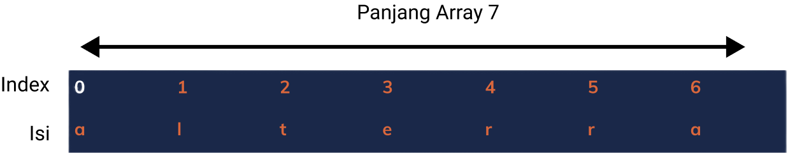

# **Array**

Rawlabs Academy

---
<style scoped>
    ul {
        font-size: 0.8rem;
    }
</style>
## What is **Array**?

- A data structure consisting of a collection of the **same data type**
- Have index start from **0 to N-1**
- Can be accessed randomly

---
## Declaring Array

```java
char[] rawlabs = new char[] {'r','a','w','l','a','b','s'};

char[] rlabs = new char[7];
rlabs[0] = 'r';
rlabs[1] = 'a';
rlabs[2] = 'w';
rlabs[3] = 'l';
rlabs[4] = 'a';
rlabs[5] = 'b';
rlabs[6] = 's';

String[] days = new String[]{"Monday", "Tuesday", 
    "Wednesday", "Thursday", "Friday",
    "Saturday", "Sunday"};
```

---
### Example
**Best Practice** : Use plural words to define variables
```java
public static void main(String[] args) {
    Person[] persons = new Person[5];
    
    persons[0] = new Person("John");
    persons[1] = new Person("Doe");
    persons[2] = new Person("Calvin");
    persons[3] = new Person("Albert");
    persons[4] = new Person("Maverick");
}
```

---
### Basic Array **Usage**

**Note**: The elements of array have index **0 to N-1**
```java
public static void main(String[] args) {
    String[] names = new String[100];
    for (int i = 0; i < names.length; i++) {
        System.out.println("Value: " + names[i] + " at index " + i);
    }
}
```

---
<style scoped>
    ul, pre {
        font-size: 0.8rem;
    }
</style>
### **Multiple Dimensional** Arrays

A multiple dimensional arrays are implemented as **arrays within arrays**.

```java
public static void main(String[] args) {
    // Element 3 x 3 from integer array
    int[][] twoD = new int[3][3];

    // Char array 2 x 3 x 4
    char[][][] = new char[2][3][4]

    // String array 2 row and 3 columns
    String[][] cats = new String[][]{
                {"Peter", "Brown"},
                {"Parker", "White"},
                {"Cony", "Black"}
        };
}
```

---
### Cont...
How to print out *"I have a cat, his name is **Parker** and have **White** color"*?

```java
public static void main(String[] args) {
    String name = cats[0][1];
    String color = cats[1][1];

    System.out.println("I have a cat, his name is " + name +
        " and have " + color + " color");
}
```

---
### Cont...

```java
public static void main(String[] args) {
    String[][] cats = new String[][]{
                {"Peter", "Brown"},
                {"Parker", "White"},
                {"Cony", "Black"}
        };
    
    for (int row = 0; row < 3; row++) {
        for (int col = 0; col < 2; col++) {
            System.out.println(cats[row][col]);
        }

        System.out.println();
    }
}
```

---
### Task 1 - Check **Prime Number**
Given an array `[2, 4, 8, 7, 9, 13, 11, 29, 18, 29, 34, 15, 17]`, create a function to check whether the numbers in the array are **prime** or not.

Expected Output:
- When prime number, print **x is Prime Number**.
- When not prime number, print **x is not Prime Number**.

---
### Task 2 - Play with **Asterisk**
Write a program to print the **asterisk triangle** as shown below.

**Input:** 5

**Output:**
```bash
    * 
   * * 
  * * * 
 * * * * 
* * * * *
```

---
<style scoped>
    p {
        font-size: 0.85rem;
    }
</style>
### Task 3 - **Multiply Table**

Write program to print table of multiply based on user input as shown below.

**Input :** 6

**Output :**
```bash
1	2	3	4	5	6	
2	4	6	8	10	12	
3	6	9	12	15	18	
4	8	12	16	20	24	
5	10	15	20	25	30	
6	12	18	24	30	36
```

---
<style scoped>
    table {
        font-size: 0.85rem;
        width: 100%;
    }
</style>
### Task 4 - **Searching** (Bonus)
Given `Person` data

| NIK | Name |
|:----|:-----|
| 0001 | Calvin |
| 0002 | Joe |
| 0003 | Maverick |
| 0004 | Kirito |
| 0005 | Andrew |

---
Write program to search `Person` by `name` **OR** by `nik`.

Test Case
- Input : `Joe`, Output : `Found data [Joe 0002]`
- Input : `0004`, Output : `Found data at [Kirito 0004]`
- Input : `Any`, Output : `Data not found`