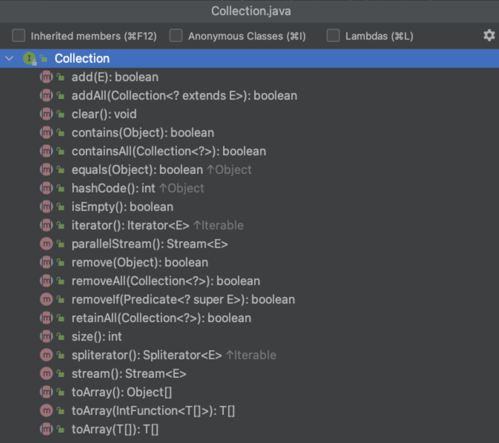

# **Iterable**

Rawlabs Academy

---
<!-- _class: lead -->
## What is **Iterable**?

The **"Iterable"** sas introduced to be able to use in the *"foreach"* loop. A class implementing the iterable can be iterated over.

---

## Java **Iterable**
**Hierarchy Interface**

---
<style scoped>
    table {
        font-size: 0.8rem;
    }
</style>
## General-purpose **Implementation**

General-purpose implememtations are the most commonly used implementattions, deigned for everyday use.

| Interface | Hash Table | Resizeable Array | Tree | Linked List | Hash Table + Linked List |
|:------|:-----|:-----|:-----|:-----|:-----|
| `Set` | `HashSet` | | `TreeSet` | | `LinkedHashSet` |
| `List` | | `ArrayList` | | `LinkedList` | |
| `Deque` | | `ArrayDeque` | | `LinkedList` | |

---
## Iterable **Methods**


---
## Example Iterable

```java
public static void main(String[] args) {
    Iterable<String> names = List.of("rawlabs", "academy");
    for (String name : names) {
        System.out.println(name);
    }
}
```

---
<style scoped>
    p {
        font-size: 0.85rem;
    }
</style>
## Iterator

The iterable interface has one `iterator()` method.

**Iterator** is class that manages iteration over an `Iterable`. It maintains a state of where we are in the current iteration, and knows what the next element is and how to get it.


---
## Example **Iterator**

```java
import java.util.Iterable;
import java.util.Iterator;
import java.util.List;

public class Main {
    public static void main(String[] args) {
        Iterable<String> names = List.of("rawlabs", "academy");
        Iterator<String> iter = names.iterator();
        while(iter.hasNext()) {
            String name = iter.next();
            System.out.println(name);
        }
    }
}
```

---
<!-- _class: lead -->
## Java **Collection**

Any group of individual objects which are represented as a single unit is known as the collection of the objects.

---

## Java **Collection**
**Hierarchy Interface**

---

## Collection **Methods**

---
### Collection Example

```java
public class Main {
    public static void main(String[] args) {
        Collection<String> names = new ArrayList<>();
        names.add("Rawlabs");
        names.add("Academy");
        names.add("Bootcamp");

        names.remove("Bootcamp");
        System.out.println(names.contains("Rawlabs"));
    }
}
```

---
## Task

Make a summary for `Iterable` and `Collection` material and provide examples of implementation other than those contained in the material.

Implementation includes :
- While loop
- Foreach loop
- Implementation methods of `Iterable` and `Collection`