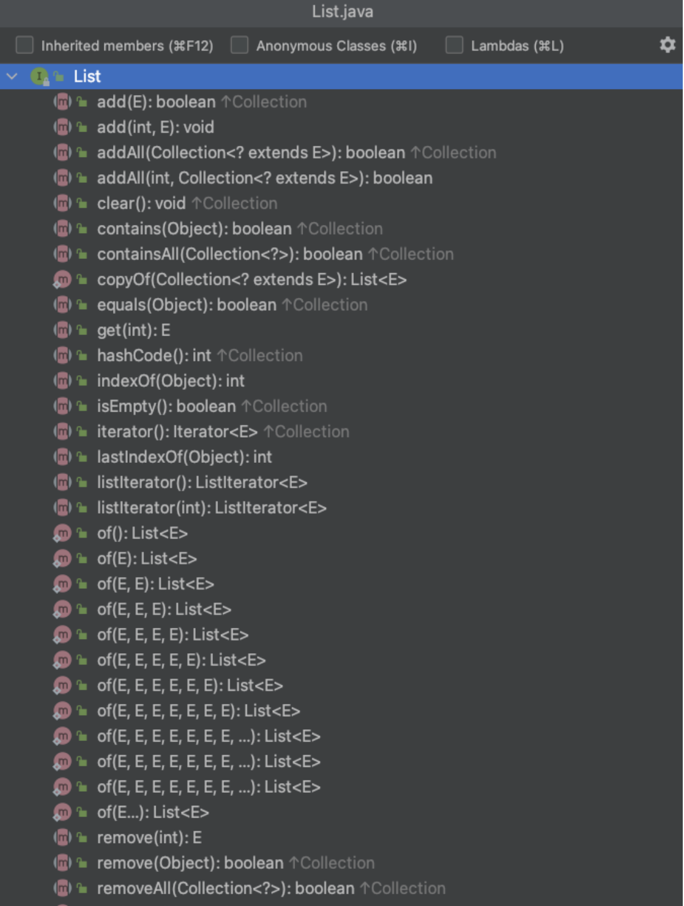
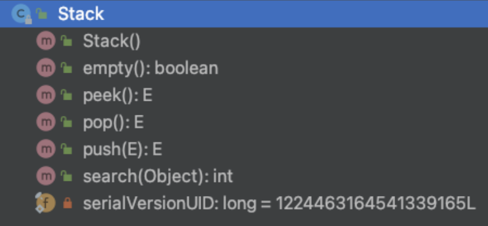

# Collection **List**

Rawlabs Academy

---
## List

- The `List` interface provides a way to **store** and **ordered collection**.
- It is a **child interface** of `Collection`
- It is an ordered collection of object in which **duplicate values** can be stored.

- Since `List` preserves the insertion order, it allows **positional access** and **insertion of elements**.

---

## Methods **List**

---


<style scoped>
    p {
        font-size: 0.8rem;
    }
</style>
## **List**
**Hierarchy**

---


<style scoped>
    p {
        font-size: 0.85rem;
    }
</style>
## Abstract **Collection**

It is used to implement an unmodifiable collection, for which one need to only extend this `AbstractCollection` class and implement only the iterator and the size methods.

---


<style scoped>
    p {
        font-size: 0.85rem;
    }
</style>
## Abstract**List**

This class provides a skeletal implementation of the `List` interface to minimize the effort required to implement this interface baked by Random Access data store (such an array). For sequential access data (such as linked list), `AbstractSequentialList` should be used in preference to this class.

---


<style scoped>
    p {
        font-size: 0.85rem;
    }
</style>
## Array**List**

Its provides us with **dynamic arrays** in java. Though, it may be slower than standard arrays but can be helpful in programs where **lots of manipulation** in the array needed.


---

## Array**List**
#### Work

---


<style scoped>
    ul {
        font-size: 0.8rem;
    }
</style>
## Linked**List**

- `LinkedList` consists of nodes where each node contains data and a reference to the next node in the list
- Unlike an array, data is not stored in one contigous block of memory and does not have a fixed size
- Instead, it consists of multiple blocks of memory at different addresses


---
### Representation **ArrayList** vs **LinkedList**


---
## **ArrayList** Example

```java
public class Main {
    public static void main(String[] args) {
        List<String> addresses = new ArrayList<>();
        addresses.add("Milan");
        addresses.add("London");
        addresses.add("Guatemala");
        addresses.add("London");

        System.out.println(addresses.get(2));
    }
}
```

---
## **LinkedList** Example

```java
public class Main {
    public static void main(String[] args) {
        List<String> addresses = new LinkedList<>();
        addresses.add("Milan");
        addresses.add("London");
        addresses.add("Guatemala");
        addresses.add("London");

        System.out.println(addresses.get(2));
    }
}
```

---
## **Immutable** List Example

```java
public class Main {
    public static void main(String[] args) {
        List<String> addresses = new LinkedList<>();
        var immutableAddresses = Collections.unmodifiableList(addresses);
        immutableAddresses.add("Texas");
        addresses.add("Milan");
        addresses.add("London");
        addresses.add("Guatemala");
        addresses.add("London");

        System.out.println(addresses.get(2));
    }
}
```

---


<style scoped>
    ul {
        font-size: 0.75rem;
    }
</style>
## Stack
- The `Stack` class represents a **last-in-first-out** (LIFO) stack of objects
- It extends class `Vector` with 5 operations that allow a vector to be treated as a stack
- The usual **push** and **pop** operations are provided, as well as a method to peek at the top item on the stack, a method to test for whether the stack is empty, and a method to search the stack for an item and discover how far it is from the top
- A more complete and consistent set of LIFO stack operations is provoided by the `Deque` **interface** and its implementations, which should be used in preference to this class.

---
## **Stack** Example

```java
public class Main {
    public static void main(String[] args) {
        Stack<String> addresses = new Stack<>();
        addresses.push("Milan");
        addresses.push("London");
        addresses.push("Guatemala");
        addresses.push("London");

        System.out.println(addresses.pop());
    }
}
```

---
## Task - **Array Merge**
Make a program to combine 2 arrays, then insert several objects into the array in the middle with the index entered.

--- 
## Task - **Play with Parking Area**
It is known that there is a parking lot that only contains 1 motorcycle in each row. Make a program to manage the parking lot so that it fills the farthest parking lot with the parking gate first and the motorbike closest to the parking gate can exit first.