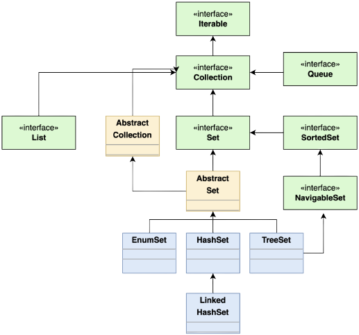
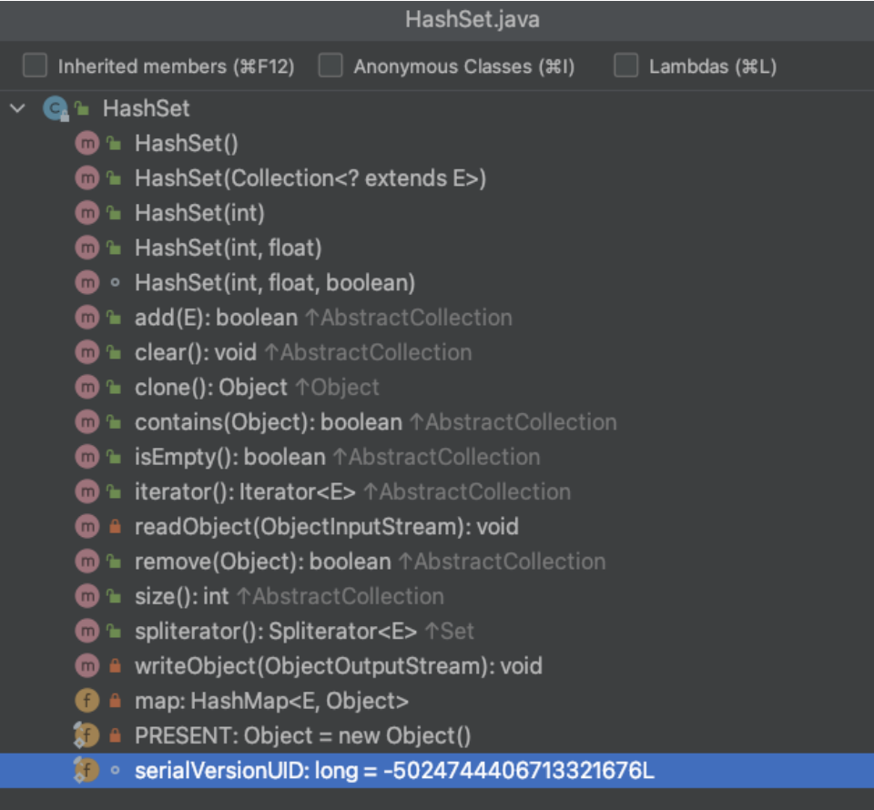
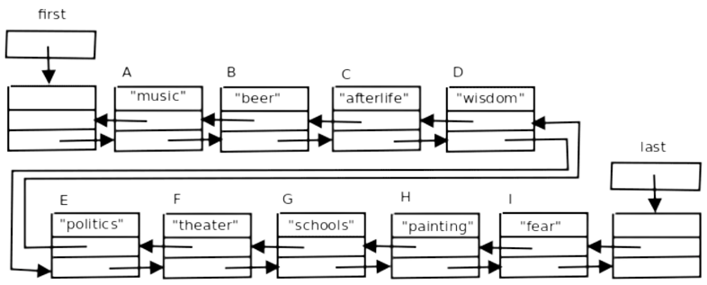
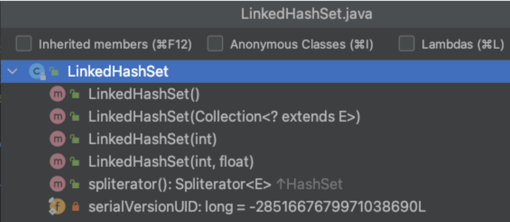
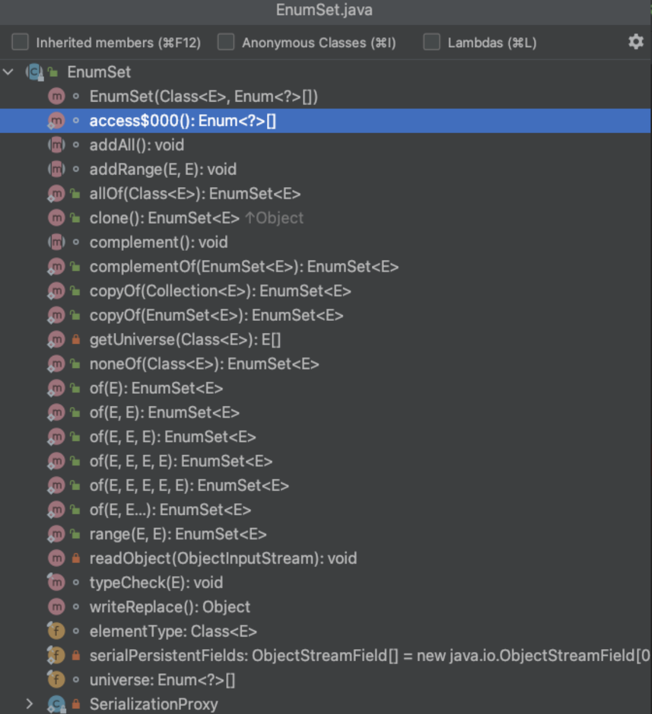
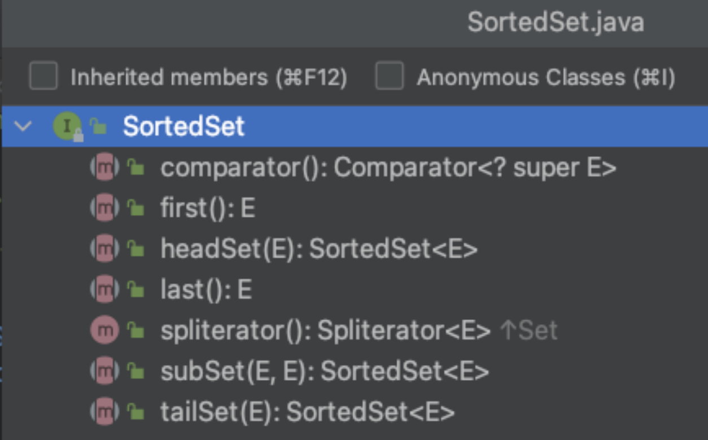

# Collection **Set**

Rawlabs Academy

---


<style scoped>
    p {
        font-size: 0.8rem;
    }
</style>
## **Set**
**Hierarchy**

---
<style scoped>
    table, p {
        font-size: 0.85rem;
    }
</style>
## Comparing Set

**`HashSet` vs `LinkedHashSet` vs `TreeSet` vs `EnumSet`**

|       | HashSet | LinkedHashSet | TreeSet | EnumSet |
|:------|:--------|:--------------|:--------|:--------|
| **Data Structure** | Hash Table | Hash Table + Linked List | Red-Black Tree | Bit Vector |
| **Sorting** | No | Insertion Order | Sorted | Natural Order |
| **Iterator** | Fail-Fast | Fail-Fast | Fail-Fast | Weakly Consistent |
| **Nulls** | Yes | Yes | Depends | No |

---


<style scoped>
    ul {
        font-size: 0.8rem;
    }
</style>
## Hash Set

- Stores the elements by using a mechanism called **hashing**.
- Contains **unique elements only**.
- Allows null value.
- Class is non synchronize.
- Doesn't maintain the insertion order. Here, elements are inserted on the basis of their hashcode.
- Is the best approach for search operations.
- The initial default capacity of `HashSet` is 16, and the load factor is 0,75.

---
## **HashSet** Example

```java
public class Main {
    public static void main(String[] args) {
        Set<Integer> age = new HashSet<>();
        age.add(12);
        age.add(15);
        age.add(10);
        age.add(22);
        age.add(32);

        System.out.prinln(age);
    }
}
```

---


<style scoped>
    ul {
        font-size: 0.85rem;
    }
</style>
## Linked Hash Set

- Java `LinkedHashSet` class contains **unique element** only like `HashSet`.
- Provides all optional set operation and permits **null elements**.
- **Non-synchronized** class.
- Maintains **insertion order**.

---
## Linked Hash Set **Methods**



---
## LinkedHashSet **Example**

```java
public class Main {
    public static void main(String[] args) {
        Set<Integer> age = new LinkedHashSet<>();
        age.add(12);
        age.add(15);
        age.add(10);
        age.add(22);
        age.add(32);

        System.out.prinln(age);
    }
}
```

---
<style scoped>
    ul {
        font-size: 0.85rem;
    }
</style>
## Enum Set
- It can **contain only enum values**, and all the values have to belong to the same enum.
- It **doesn't allow to add null values**, throwing `NullPointerException` in an attempt to do so
- It's **not thread-safe**, so we need to synchronize it externally if required.
- **The elements are stored following the order in which they are declared in the enum**.
- It **uses a fail-safe iterator** that works on a copy, so it won't throw a `ConcurrentModificationException` if the collection is modified when iterating over it.

---

## Enum Set **Methods**

---
## Enum Set **Example**

```java
public class Main {
    enum Month {
        JANUARY, FEBRUARY, MARCH, APRIL, MAY, JUNE, JULY, AUGUST,
        SEPTEMBER, OCTOBER, NOVEMBER, DECEMBER;
    }
    public static void main(String[] args) {
        Set<Month> months = EnumSet.allOf(Month.class);
        Iterator<Months> iter = months.iterator();
        while(iter.hasNext()) {
            System.out.println(iter.next());
        }
    }
}
```

---


<style scoped>
    p {
        font-size: 0.85rem;
    }
</style>
## Sorted Set

A Set that further provides a **total ordering** on its elements.

The elements are **ordered** either by using **natural ordering** or by using a `Comparator`. All elements which are inserted into a sorted set must implement the `Comparable` interface.

---
## Tree Set **Example**

```java
public class Main {
    public static void main(String[] args) {
        SortedSet<Integer> age = new TreeSet<>();
        age.add(12);
        age.add(15);
        age.add(10);
        age.add(22);
        age.add(32);

        System.out.prinln(age);
    }
}
```

---
## Navigable Set **Example**

```java
public class Main {
    public static void main(String[] args) {
        NavigableSet<Integer> age = new TreeSet<>();
        age.add(10);
        age.add(12);
        age.add(15);
        age.add(22);
        age.add(32);

        NavigableSet<Integer> ageDesc = age.descendingSet();
        System.out.prinln(age);
        System.out.prinln(ageDesc);
    }
}
```

---
<style scoped>
    p, ul {
        font-size: 0.85rem;
    }
</style>
## Task - **Array Merge**

Create a program to merge 2 arrays that given and don't have the same name in the data that was merged. And then print out the **descendance data also**.

**Note :** Do not use Brute Force

Sample Test Case :
- input : `['kazuya', 'jin', 'lee']` and `['kazuya', 'feng']`
    output : `['kazuya', 'jin', 'lee', 'feng']`
- input: `['jin', 'lee', 'leo']` and `['kazuya', 'panda', 'leo']`
    output : `['jin', 'lee', 'leo', 'kazuya', 'panda']`