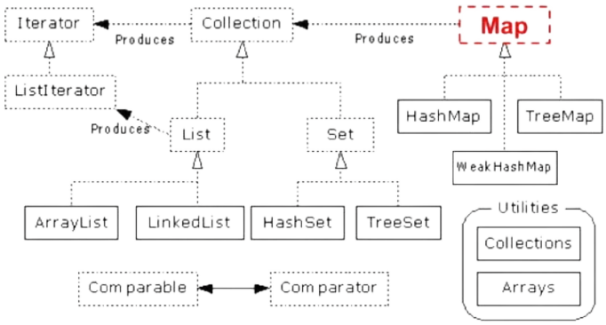
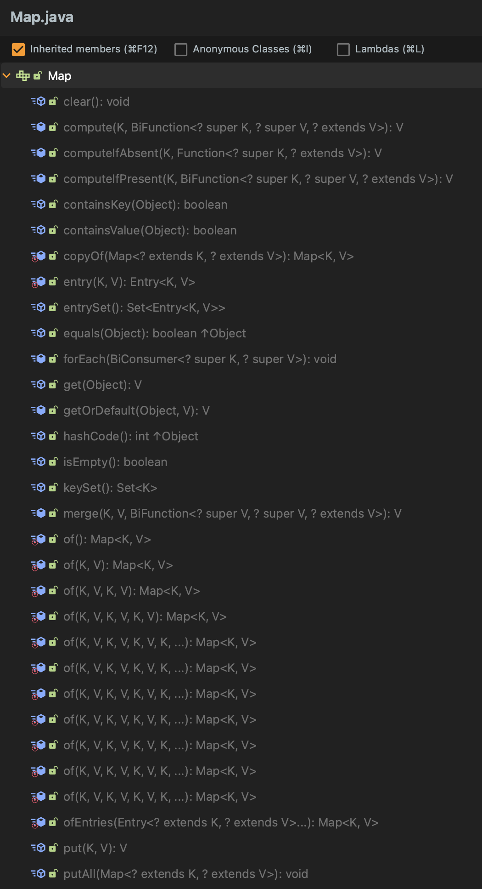
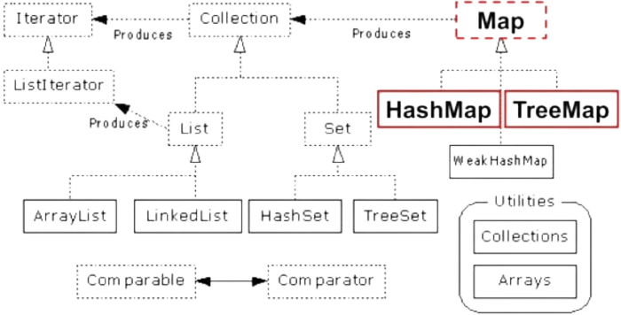

# Collection **Map**

Rawlabs Academy

---
## Map **Hierarchy**


---

## Map Methods
- Store **key** and **value** pairs
- Maps from the key to the value
- Keys are unique
    - A single key only appears once in the `Map`
    - A key can to only **one value**
- Value does not have to be unique

---
## Map **View**
- A means of **iterating** over the **keys** and **value** in a `Map`
- **Set** `keySet()`, returns the Set of keys contained in the `Map`
- **Collection** `values()`, returns the Collection of values contained in the `Map`. This Collection is not a Set, as multiple keys can map to the same value.
- **Set** `entrySet()`, returns the Set of **key-value** pairs contained in the `Map`. The `Map` interface provides a small nested interface called `Map.Entry` that is the type of the elements in this Set.

---
## Map **Entry** Example
```java
public class Main {
    public static void main(String[] args) {
        Map<Integer, String> map =  new HashMap<>();
        map.put(1, "Calvin");
        map.put(2, "Joe");
        map.put(3, "Maverick");

        for (Map.Entry m : map.entrySet()) {
            System.out.println(m.getKey() + " :: " + m.getValue());
        }
    }
}
```

---
## **HashMap** and **TreeMap** Hierarchy


---
## **HashMap** and **TreeMap**
- `HashMap`
    - The keys are a set - unique, **unordered**
    - Fast
- `TreeMap`
    - The keys are a set - unique, **ordered**
    - Same options for ordering as a `TreeSet`
        - Natural order `Comparable`, `compareTo(Object)`
        - Special order `Comparator`, `compare(Object, Object)`

---
## HashMap
- A `HashMap` contains **values** based on the **key**
- It contains only **unique elements**
- It may have **one null key** and **multiple null values**
- It maintains **no order**

---
## HashMap **Example**
```java
public class Main {
    public static void main(String[] args) {
        Map<Integer, String> map =  new HashMap<>();
        map.put(1, "Java");
        map.put(2, "Python");
        map.put(3, "Ruby");

        System.out.println("Values before remove : " + map);
        map.remove(2);

        System.out.println("Values after remove : " + map);
    }
}
```

---
## HashMap **vs** TreeMap

| HashMap | TreeMap |
|:--------|:--------|
| Can contain **one null key** | **Can't** contain a null key |
| Doesn't maintain any order| Maintain **ascending** order |

---
## Task 1 - **Array Appears Once**

Create a method that functions to identify numbers that appear once from a string that is input. String contains a collection of numbers.

**Test Case :**
- Input : `"76523752"`
  Output : `[6, 3]`
- Input : `"1122"`
  Output: `[]`

---
## Task 2 - **Array Unique**

Create a method to identify the unique value between 2 array.

**Test Case :**
- Input : `[1, 2, 3, 4]` and `[1, 3, 5, 10, 16]`
  Output : `[2, 4, 5, 10, 16]`
- Input : `[3, 8]` and `[2, 8]`
  Output : `[3, 2]`

---
## Task 3 - **Search Book**

Create class `BookPriceList` and have fields are `name`,  `price` and `discount`. Add some **object** and **value** of that class.

Create method to check discount and calculate the final price of the book you are looking for.

```text
Input book which you want to check : java
Book name : Java from Zero to Hero
Discount : 15%
Price : IDR xxx,-
```

**Note :** `Price` is represent the **final price** after discount.