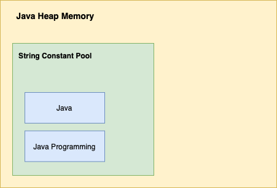

# **String, String Buffer and String Builder**

Rawlabs Academy

---
## What is **String**?
- String is **non-primitive** data type and it is also class which is under `java.lang` package.
- String is collection of characters
- Immutable
- Can create object without new keyword

---
## Why String is **Immutable**?
- String are **constants**, values can't be changed after they are created
- Because java uses the concept of **string literal**
- Suppose, fi one reference variable changes the value of the object, it will be affected to al the reference variables. That is why string objects are immutable in java.

---
### Example 1

```java
public class Main {
    public static void main(String[] args) {
        String s = "Java";
        s.concat(" Programming");
        System.out.println(s);
    }
}
```

Output : `Java`

The `concat()` method is append the string at the end. So, `String` are immutable objects.

---


---
### Example 2

```java
public class Main {
    public static void main(String[] args) {
        String s = "Java";
        s = s.concat(" Programming");
        System.out.println(s);
    }
}
```

Output : `Java Programming`

So, it assign it into the **reference variable**.

---
## **Methods**
- `charAt()`, `contains()`, `equals()`, `equalsIgnoreCase()`, `topperCase()`, `toLowerCase()`
- `length()`, `compare To()`, `join()`, `isEmpty()`, `replaceAll()`, `replaceFirst()`
- `trim()`, `index()`, `lastIndexOf()`, `toString()`,`concat()`, `replace()`, `equals()`
- `hashCode()`, `compareTolgnoreCase()`
- `split()`
- `substing()`

---

### Example 3 - **subString()**

- `substring(int index)` the parameter is start / begin index
- `subString(int start, int end)`

```java
public class Main {
    public static void main(String[] args) {
        String s = new String();
        s = "Java Programming";
        System.out.println(s.subString(5));
        System.out.println(s.subString(0, 5));
    }
}
```

---
### Example 4 - **equals()**

The String `equals()` method overrides the equals() method of Object class 

```java
public class StringDemo1 {
    public static void main(String[] args) {
        String s = "Python";
        String s1 = "python";
        1f (s.equals (s1)) {
            System.out.println("Both are equal");
        } else {
            System.out.println("Not equal");
        }
    }
}
```

---
### Example 5 - **equalsIgnoreCase()**

```java
public class StringDemo1 {

    public static void main(String[] args) {
        String s = "PYTHON";
        String s1 = "python";
        1f (s.equalsIgnoreCase (s1)) {
            System.out.println("Both are equal");
        } else {
            System.out.println("Not equal");
        }
    }
}
```
---
### Example 6 - **trim()**

```java
public class StringDemo2 {

    public static void main(String[] args) {
        String s = "Java Python";
        String s1 = "python";
        System.out.println(s);
        System.out.println(s.trim());
      
    }
}
```

---
### Example 7 - **replace()**

```java
    public static void main(String[] args) {
        String s1 = "Java is a very good language";
        String replaceString = s1.replace('v','w')
        System.out.println(replaceString);
        String replaceString1 = s1.replace("Java", "Python");
        System.out.println(s.trim());
      
    }
```

---
### Example 8 - **split()**

```java
   public class Main {
    public static void main(String[] args) {
        String str = "Learn java is fun, i will split here by comma, thank you!";
        String[] strings = str.split(", ");
        for (String s : strings) {
            System.out.println(s);
        }
    }
}
```

---
### Example 9 - **split()**

```java
public class Main {
    public static void main(String[] args) {
        String str = "Learn java is fun, i will split here by comma, thank you!";
        for (String s : str.split(" ", 3)) {
            System.out.println(s);
        }
    }
}
```

---
### Example 10 - **concat()**

It returns a `String` that represents the concatenation of this object's charachters followed by the string argument's characters.

```java
public class StringDemo8 {

    public static void main(String[] args) {
        String s = "Java";
        s.concat("Programming");
        System.out.println(s);
      
    }
}
```

---
### Example 11 - **contains()**

```java
import java.util.Scanner; 
public class StringContains{

    public static void main(String[] args) {
        Scanner scan = new Scanner(System.in);
        String s = new String();
        System.out.println("Enter a sentences");
        s = scan.nextLine();
        System.out.println("Find a setences");
        String find = scan.nextLine();
        System.out.println(s.contains(find));
    }
}
```

---
### Example 12 - **toString()**

```java
public class StringCompareTo{
    private int regno;
    private String name;
    public StringCompareTo() {
        super();
    } public StringCompareTo(int regno, String name) {
        super();
        this.regno = regno;
        this.name = name;
    } public String toString()
    { return "Name" + name + "Regno" + regno+ "\n";
    } public static void main(String[] args) {
        StringCompareTo sc = new StringCompareTo(123, "Dhivya");
        StringCompareTo sc1 = new StringCompareToO(123, "Dhiya");
        System.out.println(sc + " " + sc1);
    }
}
```

---
### Example 13 - **toUpperCase()toLoweCase(),chatAt()**

```java
public class CharttUppLow{

    public static void main(Sting[] args){
        String s = new Sting("JAVA");
        String c = "python";
        System.out.println(s.charAt(2));
        System.out.println("To lower case" + s.toLowerCase());
        System.out.println("To upper case " + c.toUpperCase());
    }
  
}
```

---
### Example 14 - **length(), join(), is Empty()**

```java
    public static void main(Sting[] args){
        StringJoinLengthIsEmpty n = new StringJoinLengthIsEmpty():
        String s a new String();
        System.out.printIn("Given String" + s.isEmpty());
        s = "Java Programming";
        s = s.join(".", "welcome", "to", "java");
        System.out.println("Join a words : " + s);
        System.out.println("The length is " + s.length()); 
        System.out.println("Given String " + s.isEmpty());
        }
  
```

---
### Example 15 - **replaceAll(), replaceFirst()**

```java
public class StringReplaceAll { 

    public static void main(String[] args) {
        String s = "Java Programming is super ";
        System.out.println(s.replaceAll("Java", "Python"));
        System.out.println(s.replaceFirst("super", "new"));
    }
    
}
  
```

---
### Example 16 - **index()**

```java
public static void main(Sting[] args){
    String s = new String("Java is a Object oriented programming");
    System.out.println(s.indexOf("is"));
    System.out.println(s.indexOf('j', 4));
    System.out.println(s.indexOf('j', 16));
    System.out.println(s.indexOf("Object"));
    System.out.println(s.indexOf("Object", 8));
    System.out.println(s.indexOf("Object", 18));
    }
  
```

---
### Example 17 - **lastIndexOf()**

```java
public class StringLastIndexOf { 

    public static void main(String[] args) {
        String s = "Java Programming is awesome, woderful ";
        System.out.println(s.lastIndexOf("o"));
        System.out.println(s.lastIndexOf("is"));
        System.out.println(s.lastIndexOf("o", 28));
        System.out.println(s.lastIndexOf("is", 28));
    }
    
}
  
```

---
### Example 18 - **compareTo()**

```java
public class StringCompareTo { 
    public static void main(String[] args) {
        String[]s = {"guru","divya","anju","ice","Divya"};
        int i;
        for(i=0;i<s.length;i++)
        {
            for(int j=i+1;j<s.length;j++)
            {
                if(s[i].compareTo(s[j])>0)
                {
                    String temp=s[i];
                    s[i] = s[j];
                    s[j] = temp;
                }
            } System.out.println(s[i]);
        }
    }  
}
```

---
### Example 19 - **compareToIgnoreCase()**

```java
package exercise30Aug19;
public class StringCompareTo { 
    public static void main(String[] args) {
        String[]s = {"guru","divya","anju","ice","Divya"};
        int i;
        for(i=0;i<s.length;i++)
        {
            for(int j=i+1;j<s.length;j++)
            {
                if(s[i].compareToIgnoreCase(s[j])>0)
                {
                    String temp=s[i];
                    s[i] = s[j];
                    s[j] = temp;
                }
            } System.out.println(s[i]);
        }
    }
}  
```

---
## What is **String Buffer**?
- StringBuffer is mutable `String`
- JavaStringBuffer calss is (synchronized)thread-safe i.e multiple threads cannot acces it simultaneously
- So it is safe and will result in an order.

---
### Why String Buffer is mutable?

```java
public class StringDemo4 {

    public static void main(String[] args) {
    StringBuffer sb = new StringBuffer("Ajith");
    sb.append("Kumar");
    System.out.println(sb);
    }
}
```
---
## **Methods**
- `apend()`, `replace()`, `setCharAt()`
- `insert()`
- `delete()`
- `reverse()`
- `length()`
- `charAt()`
- `deleteChatAt()`
- `setLength()`

---
### Example 1 - **delete(), deleteCharAt()**

```java
public class StringBufferDelete {
    public static void main(String[] args){
        StringBuffer sb = new StringBuffer("Java Programming is awesome");
        System.out.println(sb.delete(5,10));
        StringBuffer sb1 = ner StringBuffer("Python is super");
        System.out.println(sb1.deleteCharAt(10));
    }
}
```

---
### Example 2 - **reverse(), replace()**

```java
public class StringBufferReplace {
    public static void main(String[] args){
        StringBuffer sb = new StringBuffer("Java Programming is awesome");
        System.out.println(sb.replace(5, 15, "Python"));
        System.out.println(sb.reverse());
    }
}
```

---
### Example 3 - **setLength()**

```java
public class StringBufferTrim {

    public static void main(String[] args) {
    StringBuffer sb = new StringBuffer ("Java Programming is awesome");
    sb.setLength(8);
    System.out.printin(sb);
    }
}
```

---
### Example 4 - **charAt(), setCharAt()**

```java
public class StringBufferChar {

    public static void main(String[] args) {
    StringBuffer sb = new StringBuffer ("Java Programming is awesome");
    System.out.printin(sb.charAt(5));
    sb.setcharAt(10, 'p'); 
    System.out.printin(sb);
    }
}
```

---
### Example 5 - **insert()**

```java
public class StringBufferInsert {

    public static void main(String[] args) {
    StringBuffer sb = new StringBuffer ("Java Programming is awesome");
    sb.insert(17, "nice"); 
    System.out.printin(sb);
    }
}
```
---
## What is **String Builder**?
- StringBuffer is mutable `String`
- The Java StringBuilder class is same as StringBuffer class except that it is non-synchronized (not thread-safe).
- It si available since ]DK 1.5.

---
## **Methods**
- `append0()`, `replace()`, `subsequence()`, `substring()`, `charAt()` , `trimToSize()` 
- `insert()`, `delete()`, `capacity()`, `ensureCapacity()`, `reverse()`, `length()`
- StringBuffer methods is similar to StringBuilder

---
### Example 1 - **reverse()**

```java
public class StringDemo6 {

    public static void main(String[] args) {
        StringBuilder sb = new StringBuilder ("Hello");
        sb.reverse(); 
        System.out.printin(sb);
    }
}
```

---
### Example 2 - **subquence()**

```java
public class StringBuilderSubSeq {

    public static void main(String[] args) {
        StringBuilder sb = new StringBuilder ("Java is high level language");
        CharSequence cs = sb.subSequece(2, 10);
        System.out.printin(cs);
    }
}
```

---
### Example 3 - **trimToSize**

```java
public class StringBuilderTrim {
    public static void main(String[] args) {
        StringBuilder bs = new StringBuilder ("programming"); 
        System.out.println("String = "+sb);
        int length = sb.lengtho);
        int capacity = sb.capacity() ; 
        System.out.println("Length = "+length); 
        System.out.printin("Capacity = "+capacity);
        sb.trimTosize();
        length = sb.length();
        capacity = sb.capacity();
        System.out.println("Length after trimtosize = "+length);
        System.out.println("Capacity after trimtosize = "capacity);
    }
}
```
---
<style scoped>
   table {
        font-size: 0.85rem;
    }
</style>
## Difference

| String | String Buffer|
|:--------|:--------|
| It is immutable | It is mutable |
| String is slow and consumes more memory| String is fast and consumes less memory |
| When you concat too many strings because every time it creates new instance| When you concat strings |
| 1.0| 1.0|
| Java.lang.package| Java.lang.package|

---
<style scoped>
   table {
        font-size: 0.85rem;
    }
</style>
## Difference

| StringBuffer | String Builder|
|:--------|:--------|
| It is immutable | It is mutable |
| It is synchronized i.e. thread safe| It is non-synchronized i.e. thread safe |
| It means two thread can't call the methods of StringBuffer simultancously| It means two thread can call the methods of StringBuilder simultancously|
| 1.0| 1.5|
| It is less efficient| It is more efficient|