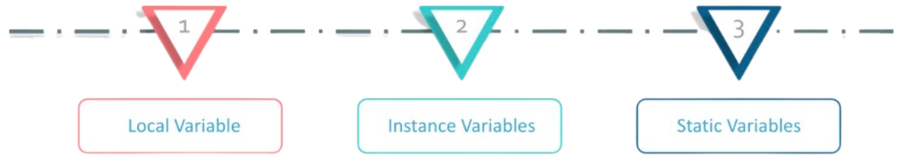
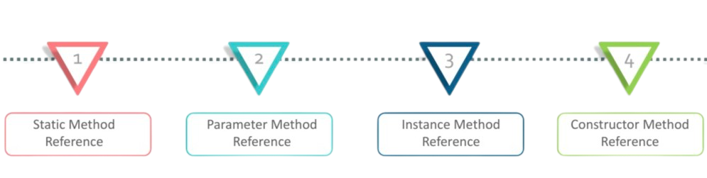

# **Java Lambda Expression**

Rawlabs Academy

---
## Java Lambda Expression
- Java lambda expression are Java's first step into functional programming
- It is an anonymous function that doesn't have a name and doesn't belong to any class
- It provides a clear and concise way to represent a method interface via an expression
- It provides the implementation of a functional interface & simplifies the software development

---
## The **Syntax**

The **syntax** is `parameter -> expression body`, **arrow operator** is introduced in Java through lambda expression that divides it into two parts i.e `Parameters` and `Body`.

**Characteristic :**
- Optional type declaration
- Optional parenthesis around parameters
- Optional curly braces
- Optional return keyword

---
<style scoped>
    pre {
        font-size: 0.8rem;
    }
</style>
### Functional Interface

```java
public class Main {
    interface Display {
        void print();
    }
    
    public static class DisplayImpl implements Display {
        @Override
        public void print() {
            System.out.println("Hello world!!!");
        }
    }

    public static void main(String[] args) {
        Display display = new DisplayImpl();
        display.print();
    }
}
```

---
### Functional Interface replace with **Lambda**

```java
public class Main {
    interface Display {
        void print();
    }

    public static void main(String[] args) {
        Display display = () -> System.out.println("Hey I'm using lambda!");
        display.print();
    }
}
```

---
### Lambda **Parameters**
- Zero parameters
    `() -> System.out.println("Hello World!");`
- One parameters
    `(param) -> System.out.println("Hi, my name is " + param);`
- Multiple parameters
    `(p1, p2) -> System.out.println("Multiple parameter: " + p1 + " :: " + p2);`

---
<style scoped>
    p, pre {
        font-size: 0.85rem;
    }
</style>
### Lambda as an **Object**

A java lambda expression is essentially an object that can assign into a variable and passed around

```java
public class Main {
    interface Operator {
        double execute(int a, int b);
    }

    public static void main(String[] args) {
        Operator sum = (a, b) -> a + b;
        System.out.println(sum.execute(6, 12));

        Operator multiply = (a, b) -> a * b;
        System.out.println(multiply.execute(2, 8));
    }
}
```

---
### Lambda **Variable Capture**

Java lamda expression can access variable that are declared outside the lambda function body under certain circumstances. 



---
<style scoped>
    pre {
        font-size: 0.95rem;
    }
</style>
#### **Local** Variable

```java
public class Main {
    interface Display {
        String print(char[] chars);
    }

    public static void main(String[] args) {
        String str = "Welcome to Rawlabs";
        Display display = (val) -> {
            return str + " :: " + new String(val);
        };

        char[] chars = {'j', 'a', 'v', 'a'};
        System.out.println(display.print(chars));
    }
}
```

---
#### **Instance** Variable

```java
public class MyLambda {
    private String str = "Rahlabs.id";

    public void print(List<String> data) {
        data.forEach(v -> {
            System.out.println(this.str + " :: " + v);
        });
    }
}
```

```java
public static void main(String[] args) {
    MyLambda consumer = new MyLambda();
    consumer.print(List.of("Calvin", "Joe"));
}
```

---
#### **Static** Variable

```java
public class MyLambda {
    private static String MY_STR = "Rahlabs.id";

    public void print(List<String> data) {
        data.forEach(v -> {
            System.out.println(MY_STR + " :: " + v);
        });
    }
}
```

```java
public static void main(String[] args) {
    MyLambda consumer = new MyLambda();
    consumer.print(List.of("Calvin", "Joe"));
}
```

---
### Lambda **Method Reference**

Method reference is used to refer method of functional interface. It is compact and easy form of lambda expression.



---
<style scoped>
    pre {
        font-size: 0.9rem;
    }
</style>
#### **Static** Method Reference

```java
public class MyLambda {
    public static String doPrint(String val) {
        return val;
    }
}
```

```java
public class Main {
    interface Display {
        String print(String val);
    }

    public static void main(String[] args) {
        Display display = MyLambda::doPrint;
        System.out.prinln(display.print("Rawlabs.id"));
    }
}
```

---
#### **Parameter** Method Reference

```java
public class Main {
    interface Display {
        String doJoin(String param1, String... param2);
    }

    public static void main(String[] args) {
        Display display = String::join;
        String str = display.doJoin(" ", "Java Bootcamp");
        System.out.println(str);
    }
}
```

---
<style scoped>
    pre {
        font-size: 0.8rem;
    }
</style>
#### **Instance** Method Reference

```java
public class StringConverter {
    public Integer convertToInt(String value) {
        return Integer.parseInt(value);
    }
}
```

```java
public class Main {
    interface NumberDeserializer {
        Integer deserialize(String value);
    }

    public static void main(String[] args) {
        StringConverter converter = new StringConverter();
        NumberDeserializer deserializer = converter::convertToInt;

        Integer number = deserializer.deserialize("15");
        System.out.println("Type: " + number.getClass().getName() + " - Value: " + number);
    }
}
```

---
#### **Constructor** Method Reference

```java
public class Main {
    interface StringFactory {
        String create(char[] value);
    }

    public static void main(String[] args) {
        StringFactory factory = String::new;
        char[] chars = {'j', 'a', 'v', 'a'};
        System.out.println(factory.create(chars));
    }
}
```

---
<!-- _class: lead -->
# Lambda Examples
# **Frequently Usage**

---
#### The Data

```java
public class Book {
    private String title;
    private String category;
    private Integer price;

    public Book(String title, String category, Integer price) {
        this.title = title;
        this.category = category;
        this.price = price;
    }

    // Getter and Setter Method
}
```

---
<style scoped>
    pre {
        font-size: 0.9rem;
    }
</style>
#### Get a **List of Value** from a **List of Object**

```java
public class Main {
    public static void main(String[] args) {
        List<Book> books = List.of(
                new Book("Become a Java Developer", "programming", 150000),
                new Book("Java for Beginner", "programming", 200000),
                new Book("Love Bird Story", "drama", 130000),
                new Book("The Thinker", "marketing", 300000)
        );

        List<String> bookNames = books
                .stream()
                .map(Book::getTitle)
                .collect(Collectors.toList());
        System.out.println(bookNames);
    }
}
```

---
<style scoped>
    pre {
        font-size: 0.9rem;
    }
</style>
#### Get a **List of Book Category**

```java
public class Main {
    public static void main(String[] args) {
        List<Book> books = List.of(
                new Book("Become a Java Developer", "programming", 150000),
                new Book("Java for Beginner", "programming", 200000),
                new Book("Love Bird Story", "drama", 130000),
                new Book("The Thinker", "marketing", 300000)
        );

        Set<String> categories = books
                .stream()
                .map(Book::getCategory)
                        .collect(Collectors.toSet());
        System.out.println(categories);
    }
}
```

---
<style scoped>
    pre {
        font-size: 0.85rem;
    }
</style>
#### Get Book List **where category == programming**

```java
public class Main {
    public static void main(String[] args) {
        List<Book> books = List.of(
                new Book("Become a Java Developer", "programming", 150000),
                new Book("Java for Beginner", "programming", 200000),
                new Book("Love Bird Story", "drama", 130000),
                new Book("The Thinker", "marketing", 300000)
        );

        List<Book> filteredBooks = books
                .stream()
                .filter(v -> "programming".equalsIgnoreCase(v.getCategory()))
                .collect(Collectors.toList());
        for (Book book : filteredBooks) {
            System.out.println(book.getTitle() + " => " + book.getCategory());
        }
    }
}
```

---
<style scoped>
    pre {
        font-size: 0.95rem;
    }
</style>
#### Grouping Book List by Category
```java
public class Main {
    public static void main(String[] args) {
        List<Book> books = List.of(
                new Book("Become a Java Developer", "programming", 150000),
                new Book("Java for Beginner", "programming", 200000),
                new Book("Love Bird Story", "drama", 130000),
                new Book("The Thinker", "marketing", 300000)
        );

        Map<String, List<Book>> map = books
                .stream()
                .collect(Collectors.groupingBy(Book::getCategory));
        System.out.println(map);
    }
}
```

---
### Task - **Play with Data**
<style scoped>
    p, table {
        font-size: 0.85rem;
    }
    table {
        width: 100%;
    }
</style>
It is known with the following data :

| Name | Interest | GPA | Status |
|:-----|:--------:|:---:|:------:|
| Calvin | Mobile | 3.5 | **PASSED** |
| Joe | Backend | 4.0 | **PASSED** |
| Albert | Web | 3.8 | **PASSED** |
| Maverick | Backend | 2.9 | **NOT_PASSED** |
| Andra | Backend | 2.5 | **NOT_PASSED** |
| Cassandra | Mobile | 3.0 | **PASSED** |

---
#### Cont...
1. Get list of cumlaude students, GPA should be greater than equal to **3.5** GPA
2. Group student by status
3. Count interest, how many took the `Mobile`, `Backend` or `Web` interest.
4. Order students by name **ascending** order
5. Order students by GPA **descending** order