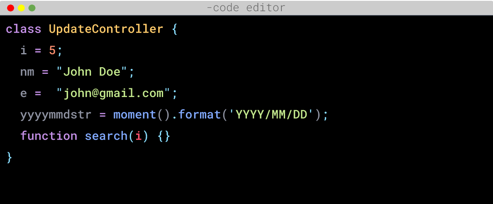
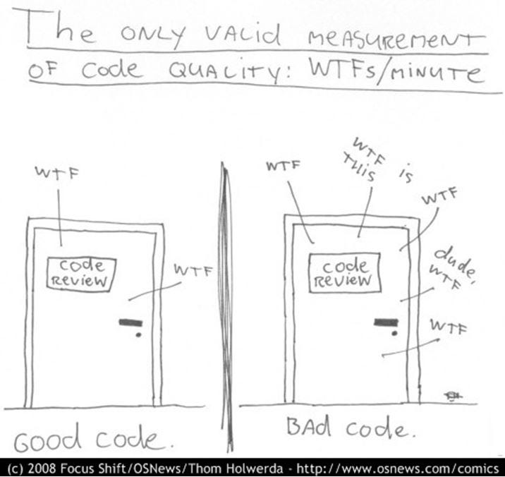
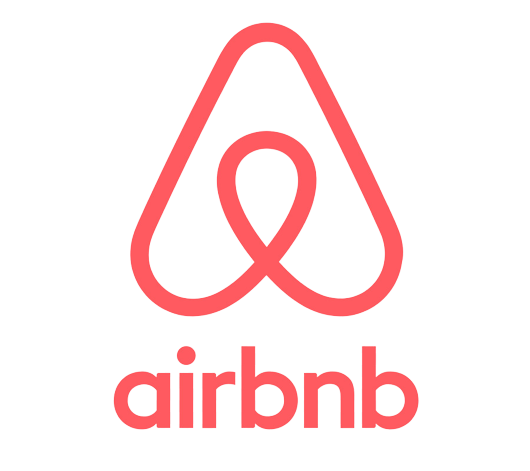

# **Clean Code**

Rawlabs Academy

---

---
<!-- _class: lead -->

# **What do you think about the code ?**

---
### What is **Clean Code**
<!-- _class: lead -->
**Clean Code** is term for code that is 'readable', 'understood' and 'altered' by programmers

---
<!-- _class: lead -->

 >Working code isn't necessary good code.Your code also need to be easy to read, understand, and modify
~ **Brandon Gregory**

---
<!-- _class: lead -->

 >Any fool can write code that a computer can understand. Good programmers write code that humans can understand.
~ **Martin Flower**

---
<!-- _class: lead -->

---
### Why **Clean Code?**

---
### Characteristic **Clean Code?**
1. Easy to understand 
2. Easy to spell and search
3. Be brief but describe the context 
4. Be consistent
5. Avoid adding unnecessary context
6. Comments
7. Good Function
8. Use Conventions
9. Formatting

---
### Example **Style Guide?**

Airbnb Javascript Stryle Guide : 
Google Python Style Guide :

---
### Suggestion **Formatting?**

1. Line width code 80-120
2. One Class 300-500 lines
3. Lines of code that are related to each other 
4. Keep the function close to its caller 
5. Declaration of adjacent variables to their users 
6. Pay attention to identation 
7. Using **prettier** or **formatter**

---
### Principle **Clean Code**
<!-- _class: lead -->

# KISS
`Keep It So Simple`

Avoid creating functions created to perform A, while modifying B, checking C functions, etc.

---
### Tips for always **KISS**
- Functions or classes should be small 
 - Functions created to perform a single task only 
 - Don't use too many arguments on functions 
 - Care must be taken to achieve a balanced, small and minimal number of conditions

 ---
### Principle **Clean Code**
<!-- _class: lead -->

# DRY
`Don't Repeat Yourself`

Code duplication occurs because of frequent copy and paste. To avoid duplication of code create functions that can be used repeatedly

 ---

 <!-- _class: lead -->

# Refactoring
 
**Refactoring** is the process of restructuring the code created, by changing the internal structure without changing the external behavior. The principle of KISS and DRY can be achieved by refactoring.

---
### Technique **Refactoring**

- Creating an abstraction 
- Breaking down code with functions/classes
- Fix code naming and location
- Detection of duplicated code