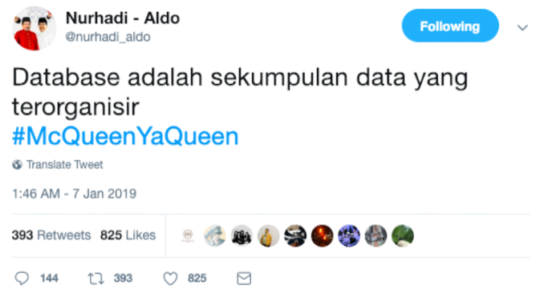
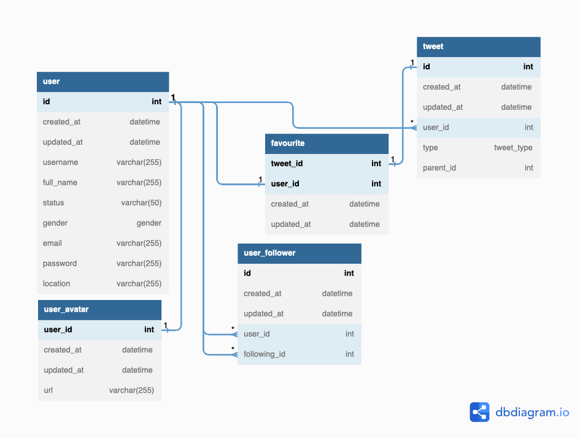
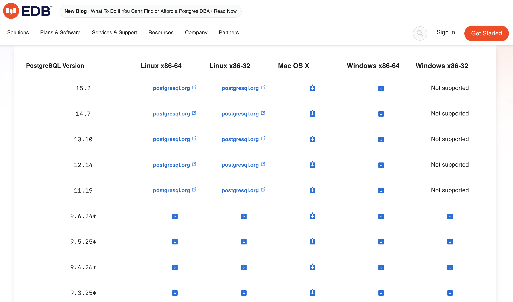
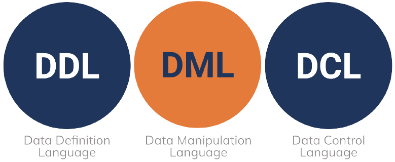
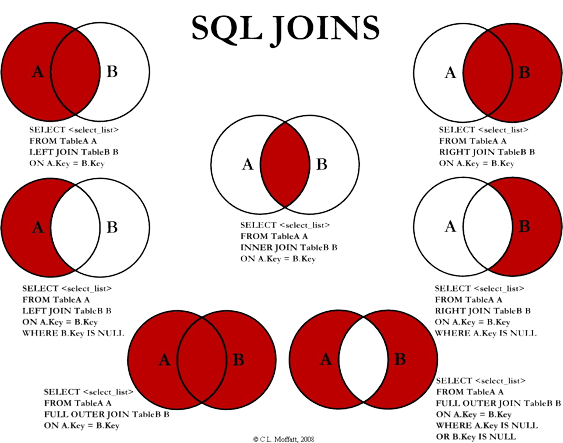

# **Database**

Schema, DDL and DML

---
### Which part of this page does **come from a database**?


---
<!-- _class: lead -->

# Can you see any **Data**?

---
<!-- _class: lead -->
<style scoped>
    ul {
        font-size: 0.9rem;
    }
</style>

- Nurhadi - Aldo
- @nurhadi_aldo
- Akun Resmi Relawan Nurhadi - Aldo Bersama Nurhadi - Aldo Menuju Indonesia Tronjal Tronjol Maha Asyik
email: dildoforindonesia@gmail.com
- Indonesia
- Joined December 2018

---
<style scoped>
    table {
        width: 100%;
    }
</style>
## Define the Model

| Account | | Account#1 |
|:--------|-|:------|
| Display Name | | Nurhadi - Aldo |
| Username | | @nurhadi_aldo |
| Bio | | Akun Resmi Relawan ... |
| Location | | Indonesia |
| Join Date | | 20/12/2018 |

---
## Database **Relationship**
\


---
<!-- _class: lead -->

### **One to One** Relationship

**One user** only have **one profile picture**

---
### **One to Many** Relationship

**One user** can have **many tweets**

---
### **Many to Many** Relationship

**One user** can have **many followers** and **one user** also can have **many following**.

---
<!-- _class: lead -->
## How to **Implement**?
We will use the online tools to create database schema
**https://dbdiagram.io/**

**Database Design as a Code**

---
<!-- _class: lead -->


---
<style scoped>
    p {
        font-size: 1.2rem;
    }
</style>
<!-- _class: lead -->
Relational Database Management System
# **RDBMS**
Tools that use based on ***Relational Database Model***
**Example :** MySQL, PostgreSQL, Oracle, etc.

---
### Install **PostgreSQL**


From the official page [here](https://www.enterprisedb.com/downloads/postgres-postgresql-downloads).

---
## SQL Command
\


---
# **DDL** Statement
```sql
CREATE DATABASE <DATABASE_NAME>;

CREATE TABLE <TABLE_NAME> (
    column1 <datatype(length)> <column_constraint>,
    column2 <datatype(length)> <column_constraint>,
    ...
    table_constraints
);

DROP TABLE <TABLE_NAME>;

ALTER TABLE <TABLE_NAME> RENAME TO <NEW_TABLE_NAME>;
```

---
<style scoped>
    pre {
        font-size: 0.8rem;
    }
</style>
### **Create** Table

```sql
CREATE TABLE user {
    id SERIAL PRIMARY KEY,
    username VARCHAR(255) NOT NULL,
    password VARCHAR(255) NOT NULL
}
```

```sql
CREATE TABLE roles {
    id SERIAL PRIMARY KEY,
    name VARCHAR(255) UNIQUE NOT NULL
}
```

```sql
CREATE TABLE user_role {
    user_id INT NOT NULL,
    role_id INT NOT NULL,
    PRIMARY KEY (user_id, role_id),
    FOREIGN KEY (user_id) REFERENCES user (id),
    FOREIGN KEY (role_id) REFERENCES roles (id)
}
```

---
<style scoped>
    pre {
        font-size: 1.5rem;
    }
</style>
### **Modify** Table

```sql
ALTER TABLE user ADD email VARCHAR(255);
ALTER TABLE user ADD phone_number INT;
```

```sql
ALTER TABLE user ALTER COLUMN phone_number TYPE VARCHAR(255);
```

---
# Data Manipulation Language (**DML**)
Commands used to **manipulate** data in tables from a database.

Statement Operation :
- `INSERT`
- `SELECT`
- `UPDATE`
- `DELETE`

---
## **INSERT**
Input data to table `user`.

```sql
INSERT INTO user (username, password, email, phone_number) VALUES
('maverick', 'mypassword', 'maverick@mail.local', '2387232');
```

Or, with returning data from modified row.

```sql
INSERT INTO user (username, password, email, phone_number) VALUES
('maverick', 'mypassword', 'maverick@mail.local', '2387232')
RETURNING id;
```

---
<style scoped>
    pre {
        font-size: 1.5rem;
    }
</style>
## **SELECT**
Get all data from `user` table.

```sql
SELECT * FROM user;
```

| id | username | password | email | phone_number |
|:--:|:---------|:---------|:------|:-------------|
| 1 | maverick | mypassword | maverick@mail.local | 2387232 |

---
<style scoped>
    pre {
        font-size: 1.5rem;
    }
</style>
### Cont...
Displays the **username** and **password** in the **user** table whose **id** is 1.
```sql
SELECT (username, password) FROM user WHERE id = 1;
```

| username | password |
|:---------|:---------|
| maverick | mypassword |

---
<style scoped>
    pre {
        font-size: 1.5rem;
    }
</style>
### Cont...
Displays the **username** and **password** in the **user** table whose **email** is not empty.

```sql
SELECT (username, password) FROM user WHERE email IS NOT NULL;
```

| username | password |
|:---------|:---------|
| maverick | mypassword |

---
<style scoped>
    pre {
        font-size: 1.5rem;
    }
</style>
## **UPDATE**
Update data into the **user** table whose **id** is 1.

```sql
UPDATE user SET email = 'test@email.local', phone_number = '128722'
WHERE id = 1
RETURNING id, username, email, phone_number;
```

| id | username | email | phone_number |
|:--:|:---------|:------|:-------------|
| 1 | maverick | test@email.local | 128722 |

---
<style scoped>
    pre {
        font-size: 2.5rem;
    }
</style>
## **DELETE**
Delete data from the **user** table whoose **id** is 1.

```sql
DELETE FROM user
WHERE id = 1
RETURNING *;
```

---
<style scoped>
    ul {
        font-size: 1.5rem;
    }
</style>
## DML Statement
- `LIKE` / `BETWEEN`
- `AND` / `OR`
- `ORDER BY`
- `LIMIT`

---
## **LIKE / BETWEEN**
Show data **username** and **email** from `user` table that **username** contains the letter **M** on first letter.

```sql
SELECT username, password FROM user
WHERE username LIKE 'M%';
```
Show data **username** and **email** from `user` table that **id** between 1 and 4.

```sql
SELECT username, password FROM user
WHERE id BETWEEN 1 AND 4;
```

---
<style scoped>
    pre {
        font-size: 1.5rem;
    }
</style>
## **AND / OR**
Show data **username** and **email** from `user` table that **username** contains the letter **M** on first letter or **id** between 1 and 4.

```sql
SELECT username, password FROM user
WHERE username LIKE 'M%' OR
id BETWEEN 1 AND 4;
```

---
<style scoped>
    pre {
        font-size: 1.5rem;
    }
</style>
## **ORDER BY**
Show data **username** and **email** from `user` table that **username** contains the letter **M** on first letter or **id** between 1 and 4 and sort the **id** by descending order.

```sql
SELECT username, password FROM user
WHERE username LIKE 'M%' OR
id BETWEEN 1 AND 4 ORDER BY id DESC;
```

---
<style scoped>
    pre {
        font-size: 1.5rem;
    }
</style>
## **LIMIT**
Show data **username** and **email** from `user` table that **username** contains the letter **M** on first letter or **id** between 1 and 4 and sort the **id** by descending order max 2 data.

```sql
SELECT username, password FROM user
WHERE username LIKE 'M%' OR
id BETWEEN 1 AND 4 ORDER BY id DESC
LIMIT 2;
```

---
<style scoped>
    p {
        font-size: 1.2rem;
    }
</style>
<!-- _class: lead -->
# **JOIN**
A clause to combine **records**
from two or more tables

---


---
<style scoped>
    ul {
        font-size: 0.8rem;
    }
</style>
## AGGREGATE
Function in which the values of multiple rows are grouped together to form a value.

- MIN : `SELECT MIN(id) AS id FROM user`
- MAX : `SELECT MIN(id) AS id FROM user`
- SUM : `SELECT SUM(favourite_count) FROM tweet WHERE user_id = 1`
- AVG : `SELECT AVG(favourite_count) FROM tweet WHERE user_id = 1`
- COUNT : `SELECT COUNT(*) FROM user;`
- HAVING : `SELECT user_id FROM tweet GROUP BY user_id`
`HAVING SUM(favourite_count) > 2`

---
## SUB QUERY
Sub Query or Inner query or Nested Query is query inside another query.

A sub query can be used to return data which will be used into main query as requirements to further limit the data to be retrieved.

Sub query can be used with `INSERT`, `SELECT`, `UPDATE` and `DELETE` statements with the operator likes `=`, `<`, `>`, `<=`, `>=`, `IN`, `BETWEEN`, etc.

---
<style scoped>
    ul {
        font-size: 0.95rem;
    }
</style>
### Rules
- Must be enclosed in brackets.
- A subquery can only have **one column** in the `SELECT` clause, except for several columns in the main query for the subquery to compare the selected columns.
- Subqueries that return more than one row can only be used with some operator values, such as the IN operator.
- A `SELECT` list **cannot include** references to the values it evaluates to
`BLOB`, `ARRAY`, `CLOB`, or `NCLOB`.
- A subquery cannot be immediately enclosed in a set function.

---
<style scoped>
    p, pre {
        font-size: 0.85rem;
    }
</style>
### **SUBQUERY** - Example
Show data `user` table whose `user_id` is in the `tweets` table.

```sql
SELECT * FROM user WHERE id IN 
(
    SELECT user_id FROM tweet GROUP BY id
);
```

Show the data `user` table whose total number of `favorite_count` per user is more than 5 in the tweets table.

```sql
SELECT * FROM USERS WHERE id IN 
(
    SELECT user_id FROM tweets GROUP BY user_id HAVING 
    SUM(favourite_count) > 5
);
```

---
## Task
1. Make a summary of the database material that has been explained
2. Create database schema using [dbdiagram.io](https://dbdiagram.io/) to manage `Car Rental` and then create DDL from the that database schema.