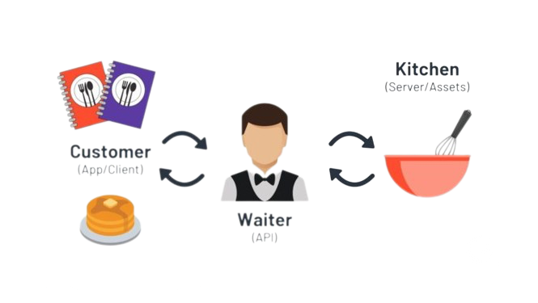

# **RESTFUL API & SPRING BOOT**
Intro REST API and Getting Started with **Spring Boot**

---
<!-- _class: lead -->

<style scoped>
    h1 {
        font-size: 2.2rem;
        color: white;
    } 
</style>
# RESTFUL API


---
 <!-- _class: lead -->
# Before REST, What is API ? 

 
 ---
 # What is **REST** ? 

 REST stands fo **RE**presentational **S**tate **T**ransfer.

 In **REST based architecture** everything is a **resource**.

 It means when a RESTful API is called, the server willl transfer to the client a representation of the state of the requested resource.

---
<style scoped>
    p {
        font-size: 1.3rem;
    }
</style>
 ## **RESTFUL API** `≠` **HTPP API**

 REST architecture and HTTP 1.1 protocol **are independent of each other** , but the HTTP 1.1 protocol was built to be the ideal protocol to follow the principles and constraints of REST

 ---
 <style scoped>
    p {
        font-size: 1.1rem;
    }
</style>
  # **HTTP**

  HTTP stands for **H**yper**t**ext **T**ransfer **P**rotocol 

  HTPP is **a protocol** that transmite hypermedia document, lika HTML, JavaScript, CSS, Image, Audio. Video etc.

  HTTP in earlier is designed for communicating between Web Browser dan Web Server, but now we use it in many applications.

---
 <!-- _class: lead -->
# HTPP Flow


---
 <!-- _class: lead -->
# HTTP Request Example 


---
<!-- _class: lead -->
# Request Line


---
<!-- _class: lead -->
# HTTP Common Method


---
<!-- _class: lead -->
# HTTP Other **Standard** Method


---
<!-- _class: lead -->
# URL


---
<style scoped>
table {
    height: 60%;
    width: 100%;
    font-size: 30px;
}
</style>
## HTTP Headers **(Example)**

| HTTP Header | Description |
|:--------|:--------|
| `Host` | Authority on URL (must be exist in HTTP 1.1) |
| `Content-Type` | Data type of HTTP Body |
| `Authorization` | Credential for authentication |
| `Accept` | Data type that client want to accept |

---
<!-- _class: lead -->
# HTTP Response Example


---
<!-- _class: lead -->
# HTTP Response Status Line


---
<!-- _class: lead -->
# List Of HTTP Status Codes


---
<!-- _class: lead -->
# HTTP Status Code


---
<style scoped>
    p {
        font-size: 0.85rem;
    }
    table {
        width: 100%;
        font-size: 30px;
    }
</style>
# REST Path URL Restriction

`/user/1/balance` (balance owned by user id 1)
`/balance/1` (balance with id 1)
Remember, everything in REST is **resource, RPC -> function method only POST or GET**

| Purpose | Method |Incorrect | Correct |
|:--------|:--------|:--------|:--------|
| Retrieves a list of users | GET | /getAllCars | /users
| Create a new user | POST | /createUser |/users
| Delete a user | DELETE | /deleteUser | /users/10
| Get balance of user | GET | /getUserBalance | /users/11/balance

---
<!-- _class: lead -->
<style scoped>
    h1 {
        font-size: 2.2rem;
        color: white;
    } 
</style>
# Before Spring Boot


---
<style scoped>
    p, ol{
        font-size: 0.9rem;
    }
</style>
## Introduce: **Build Automation** Tools
Build Automation Tools is application tool that help you manage java application.

In Java, there are **Maven** (`pom.xml`) and **Gradle**
(`Groovy / Kotlin`).
What they do?
1. Automate manage your dependencies
2. Automate manage your build application to binary
3. Automate manage your testing
4. Etc.

---
<style scoped>
    p, ul{
        font-size: 0.8rem;
    }
</style>
## Common Lifecycle in Maven
Simple, we can call lifecycle = task
- `validate`: check if all information necessary for the build is available
- `compile`: compile the source code
- `test-compile`: compile the test source code
- `test`: run unit tests
- `package`: package compiled source code into the distributable format (jar, war, ...)
- `integration-test`: process and deploy the package if needed to run integration tests
- `install`: install the package to a local repository
- `deploy`: copy the package to the remote repository

---
<style scoped>
    p {
        font-size: 1.25rem;
    }
</style>
## Common CLI in Spring Boot

`mvn spring-boot:run` -> to run spring boot

`mvn clean install` -> to clean and install all related local dependencies

`mvn clean verify` -> to clean and verify all test related local dependencies

---
<!-- _class: lead -->

<style scoped>
    h1 {
        font-size: 2.2rem;
        color: white;
    } 
</style>
# SPRING BOOT


--- 
## What is **Spring Boot** ? 
Spring Boot makes it easy to create stand-alone, production-grade Spring based Applications that you can **"just run"**.

We take an **opinionated** view of the Spring platform and third-party libraries so you can **get started with minimum fuss**. Most Spring Boot applications need minimal Spring configuration.

--- 
<style scoped>
    p {
        font-size: 1.1rem;
    }
    p > strong {
        color: rgb(0, 147, 228);
    }
</style>

## Type Framework

\
**Opinionated** -> Complete (Web Server, Controller, Data Access)

**Non Opinionated** -> Modular (Web Server)

--- 
<style scoped>
    p,ul {
        font-size: 0.8rem;
    } 
</style>
## Why Spring Boot? 

You can choose Spring Boot because of the features and benefits it offers as given here:
- It provides a flexible way to configure Java Beans, XML  configurations, and Database Transactions.
- It provides a powerful batch processing and manages REST endpoints.
- In Spring Boot, everything is auto configured; no manual configurations are needed.
- It offers annotation-based spring application 
- Eases dependency management
- It includes Embedded Servlet Container

---
## Getting Started with **Spring Boot**


--- 
## Spring Boot **Architecture**


**Note :** Get used to making it from the **bottom layer**. 

Create the model or entity that represent the table of database and then create the **data access layer**.

--- 
# Spring Boot Architecture

The `SpringApplication` class provides a convenient way to **bootstrap** a Spring application that will be started from a `main() `method. In many situations you can just delegate to the static `SpringApplication.run` method:

```java
@SpringBootApplication 
public class MyApplication {
public static void main(String[] args) { 
    SpringApplication.run(MyApplication.class, args);
    }
} 
```

---
## Project Structure
```text
.
└── com.rawlabs.demospringboot/
    ├── controller/         # Presentation layer
    │   └── ...
    ├── domain/
    │   ├── dao/            # Representation of Table
    │   │   └── ...
    │   └── dto/            # POJO Class
    │       └── ...
    ├── repository/         # Data access layer -> to database
    │   └── ...
    ├── service/            # Business logic layer
    │   └── ...
    └── DemoSpringbootApplication.java
```

---
<style scoped>
    pre {
        font-size: 0.75rem;
    }
</style>
## **Data Access Object** (DAO)
```java
@Data
@Builder
@NoArgsConstructor
@AllArgsConstructor
@Entity
@Table(name = "book")
public class Book {

    @Id
    @GeneratedValue(strategy = GenerationType.IDENTITY)
    private Long id;

    @Column(name = "title", nullable = false)
    private String title;

    @Column(name = "price", nullable = false)
    private Integer price;

}
```

--- 
<style scoped>
    table {
        width: 100%;
        font-size: 0.8rem;
    }
</style>
## Annotations

| Annotation | Description |
|:-----------|:------------|
| `@Data` | Lombok setter and getter generator |
| `@Builder` | Lombok builder class |
| `@NoArgsConstructor` | Lombok generate no arguments constructor |
| `@AllArgsConstructor` | Lombok generate all arguments constructor |
| `@Entity` | Annotate that class being used for entity |
| `@Table` | Represent the table on database |
| `@Id` | Represent ID primary key |
| `@GeneratedValue` | Generate value automatically |
| `@Column` | Represent column name on database |

---
## **Data Transfer Object** (DTO)
```java
@Data
@Builder
@NoArgsConstructor
@AllArgsConstructor
public class BookDto {

    private String title;

    private Integer price;

}
```

--- 
<style scoped>
    table {
        width: 100%;
    }
</style>
## Annotations

| Annotation | Description |
|:-----------|:------------|
| `@Data` | Lombok setter and getter generator |
| `@Builder` | Lombok builder class |
| `@NoArgsConstructor` | Lombok generate no arguments constructor |
| `@AllArgsConstructor` | Lombok generate all arguments constructor |

--- 
## Repository - **Data Access Layer**

```java
@Repository
public interface ProductRepository extends JpaRepository<Book, Long> {

}
```

\
The **annotations**
| Annotation | Description |
|:-----------|:------------|
| `@Repository` | Annotate that class being used for data access layer |

--- 
<style scoped>
    pre {
        font-size: 0.7rem;
    }
</style>

## Service - **Bussiness Logic Layer**

```java
@Service
public class BookService { 
    private final BookRepository bookRepository;

    @Autowired
    public BookService(BookRepository bookRepository) {
        this.bookRepository = bookRepository;
    }

    public Book save(BookDto request) {
        Book book = Book.builder()
                .title(request.getTitle())
                .price(request.getPrice())
                .build();
        return bookRepository.save(book);
    }

    public List<Book> getBooks() {
        return bookRepository.findAll();
    }
}
```

--- 

<style scoped>
    p {
        font-size: 1.5rem;
    }
</style>

## Annotations

| Annotation | Description |
|:-----------|:------------|
| `@Service` | Service class |
| `@Autowired` | Enabling spring boot to inject the object dependency implicitly |


--- 
<style scoped>
    p, pre {
        font-size: 0.75rem;
    }
</style>
## Controller - **Presentation Layer**

It comprises of all the logic related to User Interface (at this context is **HTTP Request** and **HTTP Response**).

```java
@RestController
@RequestMapping("/v1/book")
public class BookController {
    private final BookService bookService;

    @Autowired
    public BookController(BookService bookService) { 
        this.bookService = bookService;
    }

    @GetMapping(value = "", produces = MediaType.APPLICATION_JSON_VALUE)
    public List<Book> getBooks() {
        return bookService.getBooks();
    }
    
}
```

--- 
<style scoped>
    table {
        width: 100%;
    }
</style>
## Annotations

| Annotation | Description |
|:-----------|:------------|
| `@RestController` | Controller class |
| `@RequestMapping` | Path naming |
| `@GetMapping` | `GET` Method |
| `@PostMapping` | `POST` Method |
| `@PutMapping` | `PUT` Method |
| `@DeleteMapping` | `DELETE` Method |


--- 
<style scoped>
    p {
        font-size: 0.85rem;
    }
</style>

# **JPA and Hibernate**

Object-Relational Mapping **(ORM)** is the process of converting Java objects to database tables. In other words, this allows us to interact with a relational database without any SQL. **The Java Persistence API (JPA) is a specification that defines how to persist data in Java applications**. The primary focus of JPA is the ORM layer.

Hibernate is one of the most popular Java ORM frameworks in use today. Its first release was almost twenty years ago, and still has excellent community support and regular releases. Additionally, **Hibernate is a standard implementation of the JPA specification**, with a few additional features that are specific to Hibernate. Let's take a look at some core features of JPA and Hibernate.

--- 
<style scoped>
    pre {
        font-size: 1.25rem;
    }
</style>
## JPA Dependecies

```xml
<dependency>
    <groupId>org.springframework.boot</groupId>
    <artifactId>spring-boot-starter-data-jpa</artifactId>
</dependency>

<dependency>
    <groupId>org.postgresql</groupId>
    <artifactId>postgresql</artifactId>
</dependency>
```

--- 
<style scoped>
    pre {
        font-size: 2rem;
    }
</style>
## Spring JPA and Datasource Properties

```bash
spring.datasource.url=jdbc:postgresql://localhost:5432/demo 
spring.datasource.username=root 
spring.datasource.password=root
spring.jpa.hibernate.ddl-auto-update 
spring.jpa.show-sql=true
```
 
 ---
 <!-- _class: lead -->
