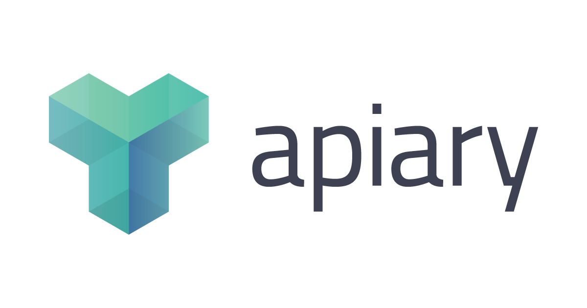

<style scoped>
    p > strong {
        color: green;
    }
</style>
# **Swagger API Docs**

Spring Boot Configure **Swagger** API Documentation

---
<style scoped>
    p {
        font-size: 0.8rem;
    }
</style>


### **API Documentation**
**API documentation** is technical content that documents the API. It includes instructions on how to effectively use and integrate the API. It also provides updates on the API's lifecycle such as new versions or retirement. Some aspects of API documentation can be generated automatically via Swagger or other documents.

---
<style scoped>
    p {
        font-size: 0.75rem;
    }
</style>

### Why use API Documentation?
Here example list api on some application.

Application will be growth based on adding new features top on it.

A large reason why API documentation is important is to increase API adoption. Comprehensive documentation on all of the functionality, how to effectively use and integrate, and updates on the API lifecycle improves the experience for those using your APIs.

---
## API Documentation Tools
  
 

These tools have different UI but functionality its same for creating api documentation.

---
<style scoped>
    h2 > strong {
        color: green;
    }
</style>
## Why **Swagger**?
Because swagger have many functionality and have standard format like **OAS 3.0**

- OpenAPI Specification
- Open Source
- Greate API docs UI for frontend or mobile developer
- Used many big companies like Microsoft, National Geographic and many more.

---

## **OpenAPI** Specification Definition

The **OpenAPI** Specification, formerly known as the Swagger Specification, is the world's standard for defining RESTful interfaces.

The OAS enables developers to design a technology-agnostic API interface that forms the basis of their API development and consumption.

---
<style scoped>
    pre {
        font-size: 0.7rem;
    }
</style>
#### OpenAPI Specifications Example

```yaml
openapi: 3.0.3
info:
  title: Swagger Petstore - OpenAPI 3.0
  version: 1.0.0
servers:
  - url: http://localhost:8080/api
paths:
  /pet:
    get:
      tags:
        - pet
      summary: Get list pet
      description: Get all pet data
      operationId: getPet
      responses:
        '200':
          description: Successful operation
          content:
            application/json:
              schema:
                type: array
                items:
                  $ref: '#/components/schemas/Pet'
```

---
<!-- _class: lead -->
# Configure **API Docs** on
# Spring Boot

---
## Preparation
We need prepare some prerequisities like below
- `springfox-boot-starter` and `springfox-swagger-ui` dependencies
- Spring Boot project
- IDE
- Glass of coffee 😁

---
<style scoped>
    p {
        font-size: 0.7rem;
    }
</style>

### In Your `pom.xml`
We need to import libraries to use functionality swagger `OAS 3.0` on spring boot.

Spring boot starter validation to **validate bean configuration** that we create for swagger

Springdoc OpenAPI starter web mvc ui to generate automatic `API docs` and `SwaggerUI`

---
<style scoped>
    p, pre {
        font-size: 0.75rem;
    }
</style>
## Swagger **Configuration**
Create `Bean Configuration` by injecting OpenAPIConfiguration `@Configuration`

```java
@Configuration
public class OpenAPIConfiguration {
  
  @Bean
  public OpenAPI openAPI() {
    return new OpenAPI()
            .info(new Info()
            .title("Rawlabs.ID")
            .description("Demo for Spring Boot")
            .version("1.0.0")
            .contact(new Contact()
                .name("Maverick")
                .url("https://piinalpin.com/")
                .email("any@email.com")));
    }

}
```

---
<style scoped>
    p, pre {
        font-size: 0.8rem;
    }
</style>
### Spring Boot Configuration `Properties`
```env
server.port=8080
server.servlet.context-path=/api
spring.application.name=demo-springboot

springdoc.packagesToScan=com.rawlabs.demospringboot.controller
springdoc.swagger-ui.enabled=true
springdoc.swagger-ui.path=/swagger-ui
springdoc.api-docs.path=/api-docs
```
The `application.properties` file will create configuration properties to enabling `SwaggerUI` and `API Docs` pre-defined path.

SwaggerUI will be generated to **http://localhost:8080/api/swagger-ui**
Base path for **servlet context** is `/api`


---
<style scoped>
    p, ul {
        font-size: 0.8rem;
    }
</style>

### Define the **Schema**
The annotation `@Schema` will create OpenAPI **Schema** to including field on endpoint example payload.

- **`description`** : The description of the field
- **`requiredMode`** : Define that field is required or not required
- **`example`** : Provide the example value

---

### API Docs on **Controller**
- **`@ApiResponses`** to store list of response 
- **`@ApiResponse`** to define individual response api docs.

---
### Generated SwaggerUI
