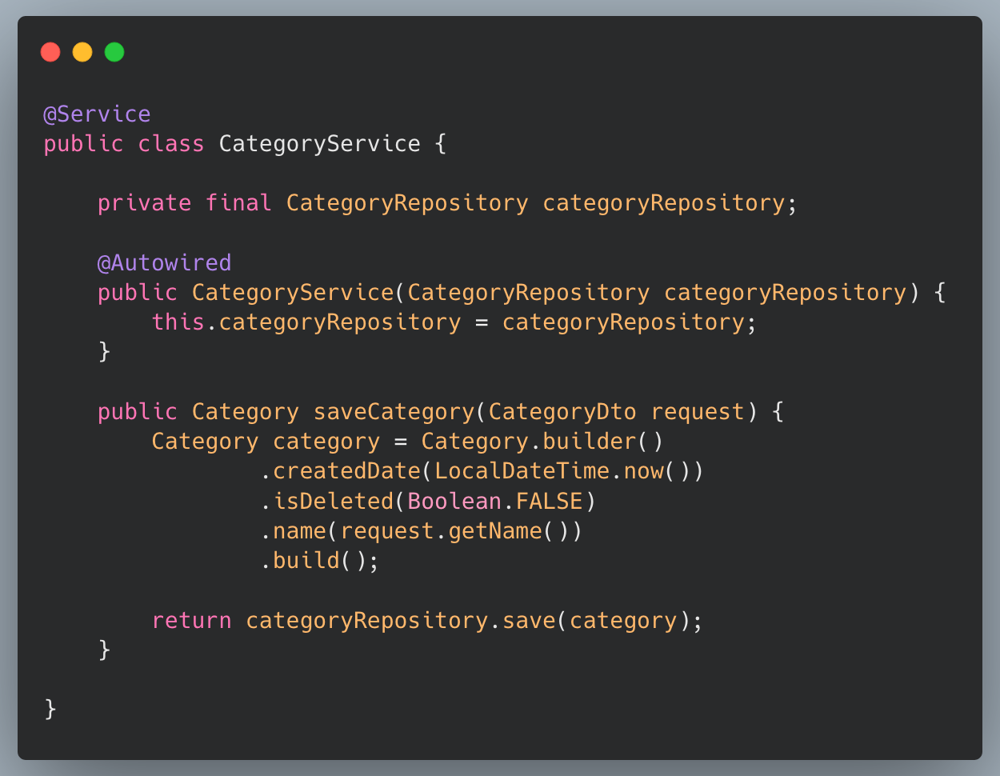
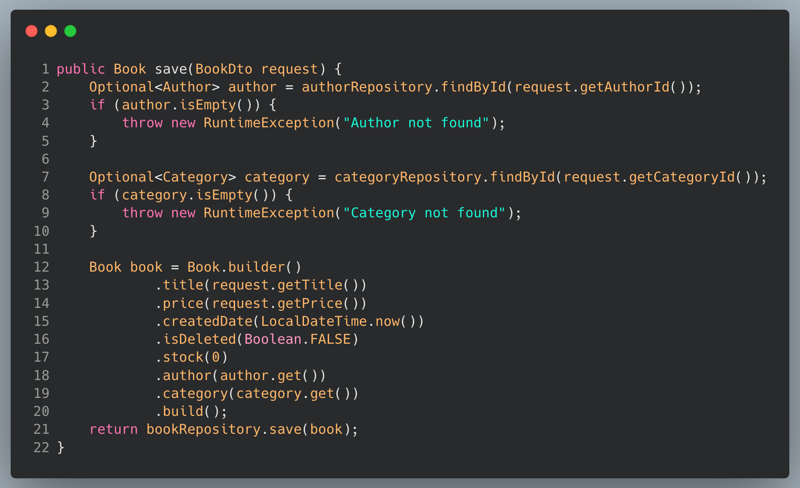

# **Spring Boot JPA Relationship**
Rawlabs Academy

---
#### Database **Design**

---
### Constant **Enum**

---

### **Book** DAO
In the previous material, we have created a `Book` model and then adjust it as in the example

---

### **Author** DAO
- `@JsonIgnore` used for ignore field from json response
- `@OneToMany` based on DB design that mean the **Author** can have **many books**.
- `cascade` When we perform some action on the target entity, the same action will be applied to the associated entity
- `fetchType` how to fetch the data, `LAZY` is fetch **when needed** and `EAGER` fetch **immediatelly**

---

### **Category** DAO
- `@OneToMany` based on DB design that mean the **Category** can have **many books**.
- `fetchType` how to fetch the data, `LAZY` is fetch **when needed** and `EAGER` fetch **immediatelly**
- `mappedBy` to be used for mapping attribute on the **`Book` DAO**

---

### Update the **Book** DAO
- `@ManyToOne` based on DB design that mean `Book` DAO have foreign key `author` and `category` then be mapped on each associated entity
- Foreign key will be generated automatically from `author` into `author_id` and `category` into `category_id` on database.

---
<!-- _class: lead -->
# Data Transfer Object
# **(DTO)**

---

---

---

---

---
<!-- _class: lead -->
# Repository
# **(JPA Repository)**

---

---

#### `BookRepository` Explanation

The query **"select b from Book b where upper(b.category.name) like upper(:category) and upper(b.author.name) like upper(:author)"** is Java Persistence Query Language **(JPQL)**

It will be translated into SQL by **"select b.\* from book b join category c on c.id = b.category_id join author a on a.id = b.author_id where upper(c.name) like upper(:category) and upper(a.name) like upper(:author)"** on native query language.

---
<!-- _class: lead -->

# **Service**

---

### **Author** Service

The `AuthorService` will be used to create new author of the book.

---

### **Category** Service

The `CategoryService` will be used to create new category of the book.

---

### Book Service `Dependency` Injection

---

### Save Book `BookService`
- The flow is, find the `author` and `category` first because the `book` have relation to `author` and `category`
- Line **18 - 19** is set attribute **association**

---

### Get List Book `Book Service`
**Why not direct use book repository?**

`Author` and `Category` have `OneToMany` relation. It can be used to get many book where have foreign key of each **Author** or **Category**

---

### Update Stock `BookService`

The flow is find book by id first if book is empty will return an exception.

If **StockType** is `ADDITIONS` that mean stock will be **added** by request value.

or if **StockType** is `REDUCTION` that mean stock will be **reducted** by request value

---
<!-- _class: lead -->

# **Controller**

---

### **Author** Controller

---

### **Category** Controller

---

### Get List Book
- If request param `author` and `category` is not empty will be get list book by author and category
- if request param only `author` is not empty will be get list book by author
- if request param only `category` is not empty will be get list book by category
- Or else get all books

---
### Update Book Stock

---
<!-- _class: lead -->

# **Soft Deletes**

---
<!-- _class: lead -->
