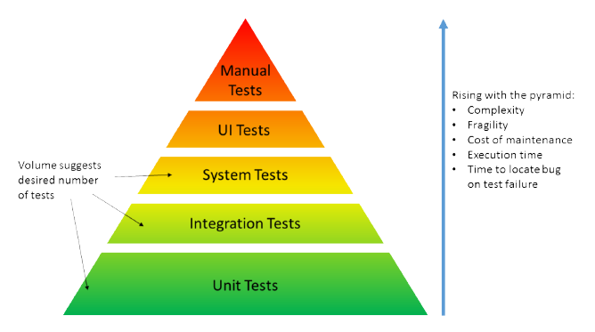
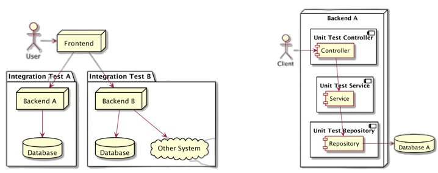

# **Java Unit Testing**
Rawlabs Academy

---
 <!-- _class: lead -->

---

# What is **Unit Testing** ? 

Is a level of the software testing process where **individual units/components** of a software/system are tested

Units are the smallest testable parts of a application

The purpose is to **validate that each unit** of the software performs as designed

---

# Integration Test vs Unit Test ?

---

# Unit Testing Concern ?
- Functional **correctness** and **completeness**
- **Error** handling
- Checking input values **(parameter)**
- Correctness of output data **(return values)**
- **Optimizing** algorithm and performance

---

# Unit Testing Benefits?
- Quality of Code
- Finds Software Bugs Early
- Faster Development
- Better Design
- Reduce Costs

---

# F.I.R.S.T Principle of Testing?
**F**ast
**I**solated/Independet
**R**epeatable 
**S**elf-validating
**T**horough

---

# Fast
- Unit tests are small pieces of code that perform one, specific task.
- Because unit tests are small, and unlike integration tests, unit tests do not communicate over the network and do not perform database operations.
- Because unit tests do not communicate with remote servers or
databases, they run very fast.
- Because unit tests is fast, use this to test all branching of the codebase

---

# Isolated/Independent
- Unit tests must be independent of each other.
- One unit test **should not depend on the result produced by another unit test**. In fact, most of the time, unit tests are run in a randomized order.
- The code you are testing or the system under test should also be **isolated from its dependencies**.
- Because of the random independent order, we can also run them in parallel to increase test speed

---

# Repeatable
- A unit test should be repeatable and **if run multiple times should produce the same result**. If a unit test is run on a different computer it should also produce the same result.
- This is why unit tests are made independent of the environment and from other unit tests.
- Be careful with Date/Time related functionality

---

# Self Validating
- To learn if a unit test has passed or not, the developer should not do any additional manual checks after the test completes
- Add as many assertion as possible
- Verify the arguments called to the dependencies, don't just
check that it is called or not called

---

# Thorough / Completeness
- We should consider a happy path as well as a negative scenario.
- Create multiple unit tests to test a function that accepts different input parameters, valid and invalid one
- Write a self-documenting method name or scenario descriptions
- If you are practicing TDD, timely will mean write tests before writing the code
- But most of the time it's not practical, instead write tests before submitting a PR for new code
- Add tests to old code as soon as possible, don't neglect writing tests after-hand

---

## What's a good structure for a unit test ? 

**3A: Arrange, Act, Assert. also called as Given, when, then.**

**Arrange:** All the data should be provided to the test when you' about to run the test and it should not depend on the environment you are running the tests 
**Act**: Invoke the actual method under test
**Assert**: At any given point, a unit test should only assert one logical outcome, multiple physical asserts can be part of this physical assert, as long as they all act on the state of the same object.

---

# Mocking Object

Mocking means creating **a fake version** of an external or internal service that can stand in for the real one.

Mocking in java you can use Mockito.

Just add @Mock to your object.

And don't forget `MockitoAnnotations.initMocks(this);`
Or you can use `@ExtendWith(Mockito Extension.class)`

---

## Giving behavior result to Mock Object

**Void**
`doNothing().when(mockObject).method();`

**Return**
`when(mockObject.method()).thenReturn(expected Result);`

**Throw**
`when(mockObject.method().thenAnswer( invocation -> { throw new
Exception("fail msg");}`

---

# Mocking **@Autowired**

You can use `@InjectMocks` in class that use Autowired objects

---

# Spring Controller Testing 

It's better to you to check all the functionalities (include Json Body, url path) of the `@RestController` or `@Controller` using MockMvc.

Defaultly, when you use MockMvc you need Spring BootApplication. But you are still able to use MockMvc without SpringBootApplication using *StandAlone*.

