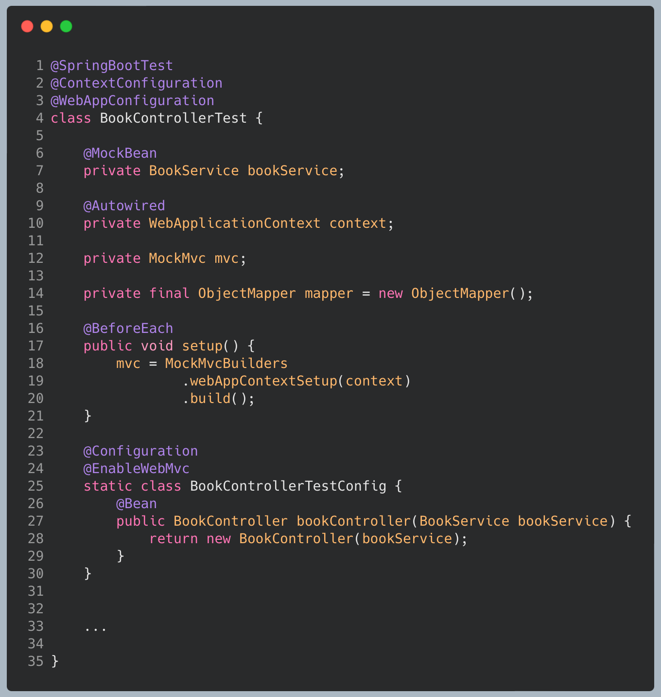

# Spring Boot ***Unit Testing*** and ***Integration Testing***
Rawlabs Academy

---
<!-- _class: lead -->

# What Is Software Testing?

---

## Software Testing

**Software Testing** is a method to check whether the actual software product matches expected requirements and to ensure that software product is `Defect` free. It involves execution of software/system components using manual or automated tools to evaluate one or more properties of interest. The purpose of software testing is to identify errors, gaps or missing requirements in contrast to actual requirements.

---
<!-- _class: lead -->

# Why Software Testing Is Important?

---
### Software Testing Is Important!

Testing is important because software bugs could be expensive or even dangerous. Software bugs can potentially cause monetary and human loss, and history is full of such examples.
- In April 2015, Bloomberg terminal in London crashed due to software glitch affected more than 300,000 traders on financial markets. It forced the government to postpone a 3bn pound debt sale.
- Nissan cars recalled over 1 million cars from the market due to software failure in the airbag sensory detectors. There has been reported two accident due to this software failure.
- Starbucks was forced to close about 60 percent of stores in the U.S and Canada due to software failure in its POS system. At one point, the store served coffee for free as they were unable to process the transaction.

---
<!-- _class: lead -->

# What Type Software Testing?

---
## Software Testing Type

---

### Software Testing Types

---
<!-- _class: lead -->

# What Is Funtional Testing?

---

## Software Testing

**Functional testing** is the process through which QAs determine if a piece of software is acting in accordance with pre-determined requirements. It uses black-box testing techniques, in which the tester has no knowledge of the internal system logic. Functional testing is only concerned with validating if a system works as intended.

---

### Functional Testing

- Unit Testing 
- Smoke Testing
- Sanity Testing
- Regression Testing 
- Integration Testing
- Beta/Usability Testing

---
<!-- _class: lead -->

# What Is Non Funtional Testing?

---

#### Non Functional Testing

**NON-FUNCTIONAL TESTING** is defined as a type of Software testing to check non-functional aspects (performance, usability, reliability, etc) of a software application. It is designed to test the readiness of a system as per nonfunctional parameters which are never addressed by functional testing.

---

### Non Functional Testing

1) Security
2) Reliability
3) Survivability
4) Availability
5) Usability
6) Scalability
7) Interoperability
8) Efficiency
9) Flexibility
10) Portability
11) Reusability

---
<!-- _class: lead -->

# What Is Maintenance Testing?

---

### Maintenance Testing

In software testing, there are more than 100 types of testing and this maintenance testing is one of them. As a tester, we do testing software during its pre-release stage. We also perform testing on the software after it is released. Performing testing after it is released is known as maintenance testing.

---
<!-- _class: lead -->

# Unit Test or Integration Test

---

### Unit Testing

**UNIT TESTING** is a type of software testing where individual units or components of a software are tested. The purpose is to validate that each unit of the software code performs as expected. Unit Testing is done during the development (coding phase) of an application by the developers. Unit Tests isolate a section of code and verify its correctness. A unit may be an individual function, method, procedure, module, or object.

---

### Integration Testing

**INTEGRATION TESTING** is defined as a type of testing where software modules are integrated logically and tested as a group. A typical software project consists of multiple software modules, coded by different programmers. The purpose of this level of testing is to expose defects in the interaction between these software modules when they are integrated

---
 <!-- _class: lead -->

---

# What is **Unit Testing** ? 

Is a level of the software testing process where **individual units/components** of a software/system are tested

Units are the smallest testable parts of a application

The purpose is to **validate that each unit** of the software performs as designed

---

# Integration Test vs Unit Test ?

---

# Unit Testing Concern ?
- Functional **correctness** and **completeness**
- **Error** handling
- Checking input values **(parameter)**
- Correctness of output data **(return values)**
- **Optimizing** algorithm and performance

---

# Unit Testing Benefits?
- Quality of Code
- Finds Software Bugs Early
- Faster Development
- Better Design
- Reduce Costs

---

# F.I.R.S.T Principle of Testing?
**F**ast
**I**solated/Independet
**R**epeatable 
**S**elf-validating
**T**horough

---

# Fast
- Unit tests are small pieces of code that perform one, specific task.
- Because unit tests are small, and unlike integration tests, unit tests do not communicate over the network and do not perform database operations.
- Because unit tests do not communicate with remote servers or
databases, they run very fast.
- Because unit tests is fast, use this to test all branching of the codebase

---

# Isolated/Independent
- Unit tests must be independent of each other.
- One unit test **should not depend on the result produced by another unit test**. In fact, most of the time, unit tests are run in a randomized order.
- The code you are testing or the system under test should also be **isolated from its dependencies**.
- Because of the random independent order, we can also run them in parallel to increase test speed

---

# Repeatable
- A unit test should be repeatable and **if run multiple times should produce the same result**. If a unit test is run on a different computer it should also produce the same result.
- This is why unit tests are made independent of the environment and from other unit tests.
- Be careful with Date/Time related functionality

---

# Self Validating
- To learn if a unit test has passed or not, the developer should not do any additional manual checks after the test completes
- Add as many assertion as possible
- Verify the arguments called to the dependencies, don't just
check that it is called or not called

---

# Thorough / Completeness
- We should consider a happy path as well as a negative scenario.
- Create multiple unit tests to test a function that accepts different input parameters, valid and invalid one
- Write a self-documenting method name or scenario descriptions
- If you are practicing TDD, timely will mean write tests before writing the code
- But most of the time it's not practical, instead write tests before submitting a PR for new code
- Add tests to old code as soon as possible, don't neglect writing tests after-hand

---

## What's a good structure for a unit test ? 

**3A: Arrange, Act, Assert. also called as Given, when, then.**

**Arrange:** All the data should be provided to the test when you' about to run the test and it should not depend on the environment you are running the tests 
**Act**: Invoke the actual method under test
**Assert**: At any given point, a unit test should only assert one logical outcome, multiple physical asserts can be part of this physical assert, as long as they all act on the state of the same object.

---

# Mocking Object

Mocking means creating **a fake version** of an external or internal service that can stand in for the real one.

Mocking in java you can use Mockito.

Just add `@Mock` to your object.

And don't forget `MockitoAnnotations.initMocks(this);`
Or you can use `@ExtendWith(Mockito Extension.class)`

---

## Giving behavior result to Mock Object

**Void**
`doNothing().when(mockObject).method();`

**Return**
`when(mockObject.method()).thenReturn(expected Result);`

**Throw**
`when(mockObject.method().thenAnswer( invocation -> { throw new
Exception("fail msg");}`

---

# Mocking **@Autowired**

You can use `@MockBean` in class that use Autowired objects

---

# Spring Controller Testing 

It's better to you to check all the functionalities (include Json Body, url path) of the `@RestController` or `@Controller` using `MockMvc`.

Defaultly, when you use MockMvc you need Spring BootApplication. But you are still able to use MockMvc without SpringBootApplication using *StandAlone*.

---
<!-- _class: lead -->

# Let's **Code**!

---
### Dependency

We only need the `spring-boot-starter-test` dependency in `pom.xml`. When we create a project at [Spring Initializr](https://start.spring.io) and import `spring-boot-starter-web`

---
<!-- _class: lead -->

# Unit Test
# **Service Class**

---

---

### Explanation
- Book save flow is
    1. Find author
    2. Find category
    3. Save book
- **Success** : Found author, category -> save book -> return. **Mock** the object of `authorRepository`, `categoryRepository` and `bookRepository`
- **Category Not Found** : Found author -> Category **NOT FOUND** -> Throw the `RuntimeException`. **Mock** the object of `authorRepository` and `categoryRepository`
- **Author Not Found** : Author **NOT FOUND** -> Throw the `RuntimeException`

---

### Service Test Class and **Dependency Injection**

- `@SpringBootTest` define unit test
- `@ContextConfiguration` define configuration context
- `@MockBean` annotation to injecting service layer as a mock service

---
### Save Book **SUCCESS TEST**

Example test case of class testing on Spring Boot.

We can be using expectation from some test case.

---
### Save Book **CATEGORY NOT FOUND**

---
### Save Book **AUTHOR NOT FOUND**

---
<!-- _class: lead -->

# Integration **Test**

---

### `BookControllerTest` **Setup**

- `@SpringBootTest` define unit test
- `@ContextConfiguration` define configuration context
- `@MockBean` annotation to injecting service layer as a mock service
- `@BeforeEach` that mean, `setup()` method will be called defore doing one test case
- `@EnableWebMvc` and `@Configuration` to create isolated context on `BookController`

---
### Save Book SUCCESS TEST **(Controller)**

The flow is to test the `Controller` class, create a fake value and then validate JSON response according the controller.

---
 <!-- _class: lead -->
