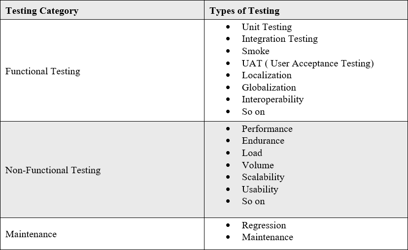
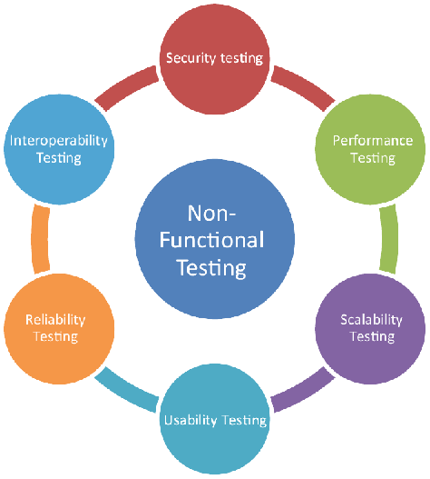
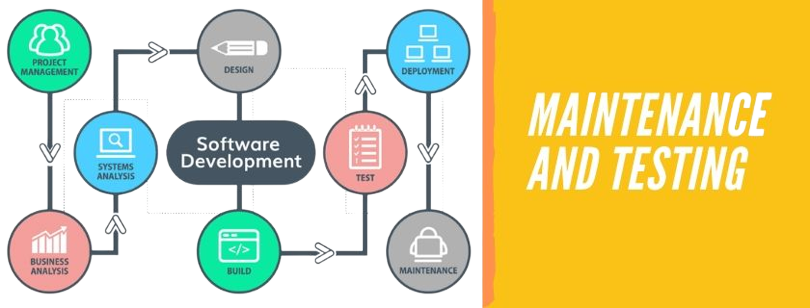
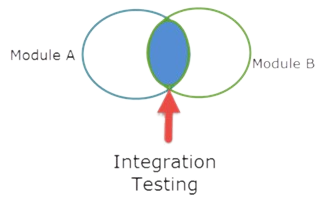

# **Java Spring - *Integration Test***
Rawlabs Academy

---
<!-- _class: lead -->

# What Is Software Testing?

---

## Software Testing

**Software Testing** is a method to check whether the actual software product matches expected requirements and to ensure that software product is `Defect` free. It involves execution of software/system components using manual or automated tools to evaluate one or more properties of interest. The purpose of software testing is to identify errors, gaps or missing requirements in contrast to actual requirements.

---
<!-- _class: lead -->

# Why Software Testing Is Important?

---
### Software Testing Is Important!

Testing is important because software bugs could be expensive or even dangerous. Software bugs can potentially cause monetary and human loss, and history is full of such examples.
- In April 2015, Bloomberg terminal in London crashed due to software glitch affected more than 300,000 traders on financial markets. It forced the government to postpone a 3bn pound debt sale.
- Nissan cars recalled over 1 million cars from the market due to software failure in the airbag sensory detectors. There has been reported two accident due to this software failure.
- Starbucks was forced to close about 60 percent of stores in the U.S and Canada due to software failure in its POS system. At one point, the store served coffee for free as they were unable to process the transaction.

---
<!-- _class: lead -->

# What Type Software Testing?

---
## Software Testing Type

---

### Software Testing Types

---
<!-- _class: lead -->

# What Is Funtional Testing?

---

## Software Testing

**Functional testing** is the process through which QAs determine if a piece of software is acting in accordance with pre-determined requirements. It uses black-box testing techniques, in which the tester has no knowledge of the internal system logic. Functional testing is only concerned with validating if a system works as intended.

---

### Functional Testing

- Unit Testing 
- Smoke Testing
- Sanity Testing
- Regression Testing 
- Integration Testing
- Beta/Usability Testing

---
<!-- _class: lead -->

# What Is Non Funtional Testing?

---

#### Non Functional Testing

**NON-FUNCTIONAL TESTING** is defined as a type of Software testing to check non-functional aspects (performance, usability, reliability, etc) of a software application. It is designed to test the readiness of a system as per nonfunctional parameters which are never addressed by functional testing.

---

### Non Functional Testing

1) Security
2) Reliability
3) Survivability
4) Availability
5) Usability
6) Scalability
7) Interoperability
8) Efficiency
9) Flexibility
10) Portability
11) Reusability

---
<!-- _class: lead -->

# What Is Maintenance Testing?

---

### Maintenance Testing

In software testing, there are more than 100 types of testing and this maintenance testing is one of them. As a tester, we do testing software during its pre-release stage. We also perform testing on the software after it is released. Performing testing after it is released is known as maintenance testing.

---
<!-- _class: lead -->

# Unit Test or Integration Test

---

### Unit Testing

**UNIT TESTING** is a type of software testing where individual units or components of a software are tested. The purpose is to validate that each unit of the software code performs as expected. Unit Testing is done during the development (coding phase) of an application by the developers. Unit Tests isolate a section of code and verify its correctness. A unit may be an individual function, method, procedure, module, or object.

---

### Unit Testing

**INTEGRATION TESTING** is defined as a type of testing where software modules are integrated logically and tested as a group. A typical software project consists of multiple software modules, coded by different programmers. The purpose of this level of testing is to expose defects in the interaction between these software modules when they are integrated  