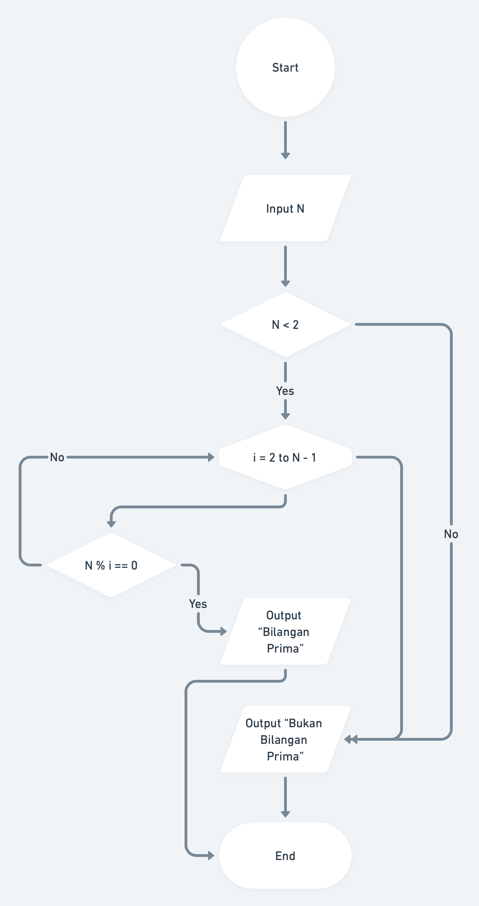

# Java Answer Key
Java Answer Key of **Rawlabs Academy**

## Table of Contents
- [01 - Introduction Algorithm](#01---introduction-algorithm)
- [02 - Basic Programming](#02---basic-programming)
- [03 - Basic Object Oriented Programming](#03---basic-object-oriented-programming)
-  [04 - Abstract Inheritence Polymorphism](#04---abstract-inheritence-polymorphism)
- [05 - Enumeration](#05---enumeration)
- [06 - Array](#06---array)
- [07 - Iterrable and Collection](#07---iterrable-and-collection)
- [08 - Collection List](#08---collection-list)


## 01 - Introduction Algorithm
### **Task**
A prime number is a natural number that is greater than 1, whose divisors are **1** and the **number itself**. The numbers **2** and **3** are **prime numbers**. The number 4 is not a prime number because it can be divided by 2.  *Create a function to determine whether the inputted number is a prime number or not using [Whimsical](https://whimsical.com)*. 

Example :
- Input: 3, Output: Prime Number
- Input: 7, Output: Prime Number
- Input: 10, Output: Not Prime Number

<p align="left">
  
</p>

## 02 - Basic Programming

### **Task 1**
Counts the number of characters in the form of vowels, consonants and total characters from the sentence *"Rahwlabs Academy"*.

**Input**: 
Rawlabs Academy

**Output**:
Vowels: 5
Consonants: 9
Total: 14

```java
public class VocalConsonant {

    public static void main(String[] args) {
        Scanner sc = new Scanner(System.in);

        System.out.print("Input a text : ");
        String text = sc.nextLine();
        sc.close();

        int vowel = 0;
        int consonant = 0;

        for (int i = 0; i < text.length(); i++) {
            char c = Character.toLowerCase(text.charAt(i));
            
            if (c == ' ') continue;

            if (c == 'a' || c == 'i' || c == 'u' || c == 'e' || c == 'o') {
                vowel++;
            } else {
                consonant++;
            }
        }

        System.out.printf("Vowels: %d\n", vowel);
        System.out.printf("Consonants: %d\n", consonant);
        System.out.printf("Total: %d\n", vowel + consonant);
    }

}
```

### **Task 2**
**Palindrome** is a word, number, phrase, or other sequence of symbols that reads the same backwards as forwards. Write a program to detect whether a string is a palindrome or not.

Input: **katak** \
Output: Palindrome

Input: **mister** \
Output: Not Palindrome

Input: **kasur rusak** \
Output: Palindrome

```java
public class Palindrome {

    public static void main(String[] args) {
        Scanner sc = new Scanner(System.in);

        System.out.print("Input a text : ");
        String text = sc.nextLine();
        sc.close();

        boolean isPalindrome = Boolean.TRUE;

        for (int i = 0; i < text.length(); i++) {
            int indexRight = (text.length() - 1) - i;
            char left = Character.toLowerCase(text.charAt(i));
            char right = Character.toLowerCase(text.charAt(indexRight));

            if (left != right) {
                isPalindrome = Boolean.FALSE;
                break;
            }
        }

        if (isPalindrome) {
            System.out.println("Palindrome");
        } else {
            System.out.println("Not Palindrome");
        }
    }

}
```

## 03 - Basic Object Oriented Programming
### **Task**
Define 5 classes freely related to the type of animal, plant or vehicle. Use encapsulation concepts such as public, protected and private according to analogy examples in the real world.

Example:
`Cat, Fish, Flower, Car, etc.`

Add instance variables and methods in each class created. Then create code to prove **encapsulation** is running as expected.

For example, can `Frog` access these `public`, `protected` or `private` variables? or other things that produce returns as expected.

```
.
└── main/
    └── participant/
        ├── MainParticipant.java
        ├── Mentee.java
        └── Person.java
    └── program/
        ├── BootcampProgram.java
        ├── Java.java
        └── MainProgram.java
    └── Main.java
```

**Package of** `main.participant`

```java
package main.participant;

public class Person {
    private String name;
    protected String gender;

    public void sayHello() {
        System.out.println("Hello I'm from public method. I can be called anywhere!");
    }

    protected void getHobby() {
        System.out.println("My hobby is coding. I can be called from sub-class");
    }

    // Setter Getter method
}
```

```java
package main.participant;

public class Mentee extends Person {
    private String bootcampProgram;

    // Setter Getter method
}
```

```java
package main.participant;

public class MainParticipant {
    public static void main(String[] args) {
        Mentee mentee = new Mentee();

        /*
        This class can call directly the protected method of Person -> getHobby()
        Also can be direct access the gender attribute
         */
        mentee.getHobby();
        mentee.gender = "Male";

        System.out.println("Gender is = " + mentee.gender);
    }
}
```

Package of `main.program`

```java
package main.program;

public class BootcampProgram {
    private String programName;
    protected Integer batch;

    // Setter Getter method
}
```

```java
package main.program;

public class Java extends BootcampProgram {
    private Integer totalSyllabus;

    // Setter Getter method
}
```

```java
package main.program;

public class MainParticipant {
    public static void main(String[] args) {
        Mentee mentee = new Mentee();

        /*
        This class can call directly the protected method of Person -> getHobby()
        Also can be direct access the gender attribute
         */
        mentee.getHobby();
        mentee.gender = "Male";

        System.out.println("Gender is = " + mentee.gender);
    }
}
```

**Package of** `main`

```java
public class Main {
    public static void main(String[] args) {
        /*
        The protected method of BootcampProgram can't be direct accessed by Java because different package
        Should use setter and getter method
         */
        Java java = new Java();
        java.setProgramName("Backend Java");
        java.setBatch(1);
        java.setTotalSyllabus(30);

        System.out.println("Program Name = " + java.getProgramName());
        System.out.println("Batch = " + java.getBatch());
        System.out.println("Total Syllabus = " + java.getTotalSyllabus());

        System.out.println("==============================");

        Mentee mentee = new Mentee();
        /*
        Method sayHello() can be direct access because it has public modifier
         */
        mentee.sayHello();
        mentee.setBootcampProgram("Backend Java");
        mentee.setName("Calvin");
        mentee.setGender("Male");

        System.out.println("Mentee Name = " + mentee.getName());
        System.out.println("Gender = " + mentee.getGender());
        System.out.println("Bootcamp Program = " + mentee.getBootcampProgram());
    }
}
```

## 04 - Abstract Inheritence Polymorphism
### Task
Create a simple calculator application with addition, subtraction, division and multiplication functions. 

Take advantage of the `input()` function in Java to `enter the desired 2 numbers` and **1 number in the form of an operation choice**. 

Print the result of the operation at the end of the section like demo on the next slide.

```java
public class MainClass {
    public static void main(String[] args) {
        Calculator calc = new Calculator();
        calc.openCalculator();
    }
}

class Calculator extends InputOutput implements Arithmetic {

    @Override
    public Integer sum(int a, int b) {
        return a + b;
    }

    @Override
    public Integer subtract(int a, int b) {
        return a - b;
    }

    @Override
    public Integer multiply(int a, int b) {
        return a * b;
    }

    @Override
    public Integer divide(int a, int b) {
        return a / b;
    }

    @Override
    void openCalculator() {
        System.out.println(this.header);
        System.out.println("1: Open Calculator");
        System.out.println("99: Exit");
        System.out.print("Input Choice : ");
        int menu = input.nextInt();
        if (menu == 1) {
            inputValueCalculator();
        }
    }

    @Override
    void inputValueCalculator() {
        System.out.println(header);
        System.out.print("Input value 1 : ");
        int a = input.nextInt();
        System.out.print("Input value 2 : ");
        int b = input.nextInt();
        menuCalculator(a, b);
    }

    @Override
    void menuCalculator(int a, int b) {
        System.out.println(header);
        System.out.println("1. Add Value");
        System.out.println("2. Subtract Value");
        System.out.println("3. Multiply Value");
        System.out.println("4. Divide Value");
        System.out.println(header);
        System.out.println("Select operation : ");
        Integer n = input.nextInt();
        Integer result = 0;
        if (n == 1) {
            result = sum(a, b);
        } else if (n == 2) {
            result = subtract(a, b);
        } else if (n == 3) {
            result = multiply(a, b);
        } else if (n == 4) {
            result = divide(a, b);
        } else {
            System.out.println("Invalid Menu");
            return;
        }
        outputValueCalculator(n, result);
    }

    @Override
    void outputValueCalculator(int menu, int result) {
        System.out.println(header);
        System.out.println("Operation : " + menu);
        System.out.println("Result : " + result);
    }

}

abstract class InputOutput {

    protected String header = "+++++++++++++ CALCULATOR +++++++++++++";
    protected Scanner input = new Scanner(System.in);

    abstract void openCalculator();
    abstract void inputValueCalculator();
    abstract void menuCalculator(int a, int b);
    abstract void outputValueCalculator(int menu, int result);

}

interface Arithmetic {

    Integer sum(int a, int b);
    Integer subtract(int a, int b);
    Integer multiply(int a, int b);
    Integer divide(int a, int b);

}
```

### Task

- `Vehicle` is a parent of all existing classes. And have property:
    - `name` : for object name
    - `isUseEngine` : flag object if has engine or not
- `Bike`, `Car` and `Bus` is a child from `Vehicle`
- Class `Bike`
    - `wheelCount` : number of wheels owned
- Class `Car`
    - `wheelCount`
    - `engineType` : type of engine
- Class `Bus`
    -  `wheelCount`
    - `isPrivateBus` : flag bus is private or public
- Every class have method `identifyMySelf()` that **overrides** from `Vehicle` to print out like demo on the next slide

```java
public class MainClass {
    public static void main(String[] args) {
        Vehicle pedalBike = new Bike("Pedal Bike", Boolean.FALSE, 2);
        pedalBike.identityMyself();
        System.out.println();

        Vehicle motorBike = new Bike("Motor Bike", Boolean.TRUE, 2);
        motorBike.identityMyself();
        System.out.println();

        Vehicle cityCar = new Car("City Car", Boolean.TRUE, 4, "4 Cylinder");
        cityCar.identityMyself();
        System.out.println();

        Vehicle sportCar = new Car("Sport Car", Boolean.TRUE, 4, "12-V Cylinder");
        sportCar.identityMyself();
        System.out.println();

        Vehicle transBus = new Bus("Public Bus", Boolean.TRUE, 6, Boolean.FALSE);
        transBus.identityMyself();
        System.out.println();

        Vehicle schoolBus = new Bus("Private Bus", Boolean.TRUE, 6, Boolean.TRUE);
        schoolBus.identityMyself();
        System.out.println();
    }
}

class Vehicle {
    protected String name;
    protected boolean isUseEngine;

    public Vehicle(String name, boolean isUseEngine) {
        this.name = name;
        this.isUseEngine = isUseEngine;
    }

    public void identityMyself() {
        System.out.println("Hi I'm Parent of All Vehicles, My name is " + this.name + ", My Engine Status is '" + (this.isUseEngine ? "with engine" : "no engine") + "'");
    }
}

class Bike extends Vehicle{

    protected Integer wheelCount;

    public Bike(String name, boolean isUseEngine, Integer wheelCount) {
        super(name, isUseEngine);
        this.wheelCount = wheelCount;
    }

    @Override
    public void identityMyself() {
        System.out.println("Hi I'm Bike , My name is " + this.name + ", My Engine Status is '"
                + (this.isUseEngine ? "with engine" : "no engine") + "', I have " + this.wheelCount + " Wheel(s)");
    }
}

class Bus extends Vehicle {

    protected Integer wheelCount;
    protected boolean isPrivateBus;

    public Bus(String name, boolean isUseEngine, Integer wheelCount, boolean isPrivateBus) {
        super(name, isUseEngine);
        this.wheelCount = wheelCount;
        this.isPrivateBus = isPrivateBus;
    }

    @Override
    public void identityMyself() {
        System.out.println("Hi I'm Bus [" + (this.isPrivateBus ? "Private Bus" : "Public Bus") + "] , My name is "
                + this.name + ", My Engine Status is '" + (this.isUseEngine ? "with engine" : "no engine")
                + "', I have " + this.wheelCount + " Wheel(s)");
    }
}

class Car extends Vehicle {

    protected Integer wheelCount;
    protected String engineType;

    public Car(String name, boolean isUseEngine, Integer wheelCount, String engineType) {
        super(name, isUseEngine);
        this.wheelCount = wheelCount;
        this.engineType = engineType;
    }

    @Override
    public void identityMyself() {
        System.out.println("Hi I'm Car , My name is " + this.name + ", My Engine Status is '"
                + (this.isUseEngine ? "with engine" : "no engine") + "', I have " + this.wheelCount
                + " Wheel(s), My Engine Type = " + this.wheelCount);
    }
}
```

### Task
- `Animal` is a parent of all existing classes. And have property:
    - `name` : object name
    - `foodType` : type of food
    - `isSharpTeeth` : flag teeth is sharp or blunt
- `Herbivor`, `Carnivor` and `Omnivor` is a child from `Animal`
- Class `Herbivor`
    - Should eat plants
    - Should have blunt teeth
- Class `Carnivor`
    - Should eat meat
    - Should have sharp teeth
- Every class have method `identifyMySelf()` that **overrides** from `Animal` to print out like demo on the next slide

```java
public class MainClass {
    public static void main(String[] args) {
        Animal animal = new Animal("Animal", "All", "Sharp and Blunt");
        animal.identityMySelf();
        System.out.println();

        Animal herbivor = new Herbivor("Cow");
        herbivor.identityMySelf();
        System.out.println();

        Animal carnivor = new Carnivor("Tiger");
        carnivor.identityMySelf();
        System.out.println();

        Animal omnivor = new Omnivor("Cat");
        omnivor.identityMySelf();
        System.out.println();
    }
}

class Animal {
    protected String name;
    protected String foodType;
    protected String toothType;

    public Animal(String name, String foodType, String toothType) {
        this.name = name;
        this.foodType = foodType;
        this.toothType = toothType;
    }

    public void identityMySelf() {
        System.out.println("Hi I'm Parent of All Animal, My name is " + this.name);
    }
}

class Herbivor extends Animal {
    public Herbivor(String name) {
        super(name, "Plants", "Blunt");
    }

    @Override
    public void identityMySelf() {
        System.out.println("Hi I'm Herbivor , My Name is " + this.name + ", My Food is '"
                + this.foodType + "', I have " + this.toothType + " teeth");
    }
}

class Carnivor extends Animal {
    public Carnivor(String name) {
        super(name, "Meat", "Sharp");
    }

    @Override
    public void identityMySelf() {
        System.out.println("Hi I'm Carnivor , My Name is " + this.name + ", My Food is '"
                + this.foodType + "', I have " + this.toothType + " teeth");
    }
}

class Omnivor extends Animal {
    public Omnivor(String name) {
        super(name, "Meat and Plants", "Sharp and Blunt");
    }

    @Override
    public void identityMySelf() {
        System.out.println("Hi I'm Omnivor , My Name is " + this.name + ", My Food is '"
                + this.foodType + "', I have " + this.toothType + " teeth");
    }
}
```

## 05 - Enumeration
### Task

Create a method to check **Boba drink** payment if the payment is less than the price then throw a custom exception. And make validation if the selected **Boba menu** does not match the enum, then throw a custom exception with a message. 

**Note**: Take advantage of user input

```text
Input Boba menu : Boba Tea
Input Size : REGULAR
Input payment : 10000

Exception in thread "main" InvalidAmountException: Your amount is less than price!
```

```text
Input Boba menu : Boba Tea
Input Size: EXTRA_LARGE

Exception in thread "main" InvalidBobaSizeException: Invalid boba size!
Available boba size: [REGULAR, LARGE]
```

File `BobaSize.java`
```java
public enum BobaSize {
    REGULAR(12000),
    LARGE(15000);

    private final Integer price;

    BobaSize(Integer price) {
        this.price = price;
    }

    public Integer getPrice() {
        return price;
    }

}
```

File `InvalidAmountException.java`
```java
public class InvalidAmountException extends RuntimeException {
    public InvalidAmountException(String message) {
        super(message);
    }
}
```

File `InvalidBobaSizeException.java`
```java
public class InvalidBobaSizeException extends RuntimeException {
    public InvalidBobaSizeException(String message) {
        super(message);
    }

    @Override
    public String getMessage() {
        return super.getMessage() + "\nAvailable boba size: " + Arrays.toString(BobaSize.values());
    }
}
```

File `Main.java`
```java
public class Main {
    public static void main(String[] args) {
        Scanner sc = new Scanner(System.in);
        System.out.print("Input Boba menu : ");
        String bobaMenu = sc.nextLine();

        System.out.print("Input Size : ");
        String size = sc.nextLine();

        BobaSize bobaSize;

        try {
            bobaSize = BobaSize.valueOf(size);
        } catch (Exception e) {
            System.out.println();
            throw new InvalidBobaSizeException("Invalid boba size!");
        }

        System.out.print("Input Payment : ");
        Integer amount = sc.nextInt();
        sc.close();

        if (amount <= bobaSize.getPrice()) {
            System.out.println();
            throw new InvalidAmountException("Your amount is less than price!");
        }

    }
}
```

## 06 - Array
### Task 1 - Check **Prime Number**
Given an array `[2, 4, 8, 7, 9, 13, 11, 29, 18, 29, 34, 15, 17]`, create a function to check whether the numbers in the array are **prime** or not.

Expected Output:
- When prime number, print **x is Prime Number**.
- When not prime number, print **x is not Prime Number**.

```java
public class Main {

    static boolean isPrimeNumber(Integer number) {
        if (number == 1) {
            return false;
        }
        for (int i = 2; i < number; i++) {
            if (number%i == 0) {
                return false;
            }
        }
        return true;
    }

    public static void main(String[] args) {
        int[] arr = {2, 4, 8, 7, 9, 13, 11, 29, 18, 29, 34, 15, 17};
        for (int i = 0; i < arr.length; i++) {
            int number = arr[i];
            if (isPrimeNumber(number)) System.out.println(number + " is Prime Number");
            else System.out.println(number + " is not Prime Number");
        }
    }
}
```

### Task 2 - Play with **Asterisk**
Write a program to print the **asterisk triangle** as shown below.

**Input:** 5

**Output:**
```bash
    * 
   * * 
  * * * 
 * * * * 
* * * * *
```

```java
public class Main {

    public static void main(String[] args) {
        Scanner input = new Scanner(System.in);
        System.out.print("Input : ");
        int total = input.nextInt();

        for (int i = 1; i <= total; i++) {
            for (int j = total-1; j >= i; j--) {
                System.out.print(' ');
            }
            for (int k = 1; k <= i; k++) {
                System.out.print("* ");
            }
            System.out.println();
        }
    }

}
```

### Task 3 - **Multiply Table**

Write program to print table of multiply based on user input as shown below.

**Input :** 6

**Output :**
```bash
1	2	3	4	5	6	
2	4	6	8	10	12	
3	6	9	12	15	18	
4	8	12	16	20	24	
5	10	15	20	25	30	
6	12	18	24	30	36
```

```java
public class Main {

    public static void main(String[] args) {
        Scanner input = new Scanner(System.in);
        System.out.print("Input : ");
        int total = input.nextInt();

        for (int i = 1; i <= total; i++) {
            for (int j = 1; j <= total; j++) {
                Integer result = i * j;
                System.out.print(result + "\t");
            }
            System.out.println();
        }
    }

}
```

### Task 4 - **Searching** (Bonus)
Given `Person` data

| NIK | Name |
|:----|:-----|
| 0001 | Calvin |
| 0002 | Joe |
| 0003 | Maverick |
| 0004 | Kirito |
| 0005 | Andrew |

Write program to search `Person` by `name` **OR** by `nik`.

Test Case
- Input : `Joe`, Output : `Found data [Joe 0002]`
- Input : `0004`, Output : `Found data at [Kirito 0004]`
- Input : `Any`, Output : `Data not found`

```java
public class Main {

    static class Person {
        private String name;
        private String nik;

        public Person(String name, String nik) {
            this.name = name;
            this.nik = nik;
        }
        
        // Getter and Setter method
    }

    public static void main(String[] args) {
        Scanner input = new Scanner(System.in);
        System.out.print("Input : ");
        String searchKey = input.nextLine();

        Person calvin = new Person("Calvin", "001");
        Person joe = new Person("Joe", "002");
        Person maverick = new Person("Maverick", "003");
        Person kirito = new Person("Kirito", "004");
        Person andrew = new Person("Andrew", "005");

        Person[] people = {calvin, joe, maverick, kirito, andrew};
        String result = "Data not found!";

        for (int i = 0; i < people.length; i++) {
            Person person = people[i];
            if (searchKey.equalsIgnoreCase(person.getName()) ||
                    searchKey.equalsIgnoreCase(person.getNik())) {
                result = "Found data [" + person.getName() + " " + person.getNik() + "]";
            }
        }

        System.out.println(result);
    }
}
```

## 07 - Iterrable and Collection
### Task

Make a summary for `Iterable` and `Collection` material and provide examples of implementation other than those contained in the material.

Implementation includes :
- While loop
- Foreach loop
- Implementation methods of `Iterable` and `Collection`

```java
public class Main {

    public static void main(String[] args) {
        Collection<Mentee> mentees = List.of(
                new Mentee("Calvin", "Male"),
                new Mentee("Maverick", "Male"),
                new Mentee("Cassandra", "Female")
        );

        System.out.println("Use iterator");
        Iterator<Mentee> iter = mentees.iterator();
        while (iter.hasNext()) {
            Mentee mentee = iter.next();
            System.out.println("Name : " + mentee.getName() + ", Gender : " + mentee.getGender());
        }

        System.out.println();
        System.out.println("Use foreach");
        for (Mentee mentee : mentees) {
            System.out.println("Name : " + mentee.getName() + ", Gender : " + mentee.getGender());
        }

    }

    public static class Mentee {
        private String name;
        private String gender;

        public Mentee(String name, String gender) {
            this.name = name;
            this.gender = gender;
        }

        // Getter and Setter method
    }

}
```

## 08 - Collection List
### Task - **Array Merge**
Make a program to combine 2 arrays, then insert several objects into the array in the middle with the index entered.

```java
public class Main {

    public static void main(String[] args) {
        List<String> data1 = List.of("One", "Two", "Three");
        List<String> data2 = List.of("Four", "Five");

        List<String> result = new ArrayList<>(data1);
        result.addAll(data2);
        System.out.println(result);
    }

}
```
 
### Task - **Play with Parking Area**
It is known that there is a parking lot that only contains 1 motorcycle in each row. Make a program to manage the parking lot so that it fills the farthest parking lot with the parking gate first and the motorbike closest to the parking gate can exit first.

```java
public class Main {

    public static void main(String[] args) {
        Stack<String> motor = new Stack<>();
        Scanner sc = new Scanner(System.in);
        String type;
        do {
            System.out.print("Input Type\n1. Motor Masuk\n 2. Motor Keluar\n99. Exit\nMasukkan Pilihan : ");
            type = sc.nextLine();

            if ("1".equalsIgnoreCase(type)) {
                System.out.print("Input plat nomor : ");
                String plat = sc.nextLine();
                motor.push(plat);
            } else if ("2".equalsIgnoreCase(type)) {
                System.out.println("Motor keluar : " + motor.peek());
                motor.pop();
            }

            System.out.println("Data motor : " + motor);
        } while (!"99".equalsIgnoreCase(type));
    }

}
```

## 09 - Collection Set
### Task - **Array Merge**

Create a program to merge 2 arrays that given and don't have the same name in the data that was merged. And then print out the **descendance data also**.

**Note :** Do not use Brute Force

Sample Test Case :
- input : `['kazuya', 'jin', 'lee']` and `['kazuya', 'feng']`
    output : `['kazuya', 'jin', 'lee', 'feng']`
- input: `['jin', 'lee', 'leo']` and `['kazuya', 'panda', 'leo']`
    output : `['jin', 'lee', 'leo', 'kazuya', 'panda']`

```java

```

## 10 - Collection Map
## 11 - Java Generic Method and Generic Class
## 12 - String Buffer and String Builder
## 13 - Lambda Expression